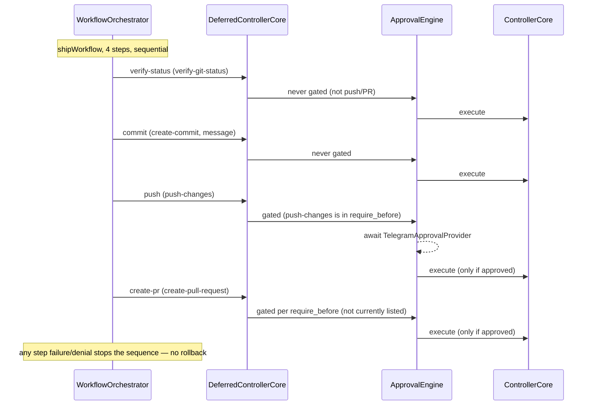
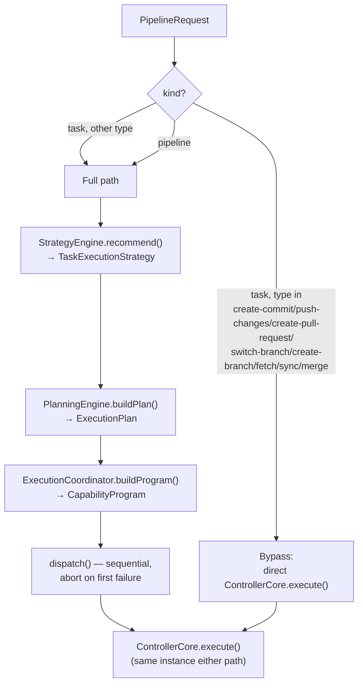

# Execution Pipeline

> Companion to [architecture.md](./architecture.md) and [SYSTEM_DESIGN.md](./SYSTEM_DESIGN.md).
> This document traces exactly how a request — from Telegram or from the autonomous execution
> worker — becomes a real `git`/`claude`/`gh` invocation, including the approval gate and every
> decision point in between.

## Task types and workflows

`Task` is a closed, 15-variant union (`src/planner/types.ts`). `WorkflowFactory` maps each to
exactly one workflow class:

| Task type | Workflow class | Behavior |
|---|---|---|
| `analyze-repository` | `AnalyzeRepositoryWorkflow` | Prompts Claude to analyze the repository (or a focused area, via `input.focus`) |
| `review-code` | `ReviewCodeWorkflow` | Prompts Claude to review the repository (or a focused area, via `input.focus`) |
| `explain-code` | `ExplainCodeWorkflow` | Requires `input.target`; prompts Claude to explain that part of the codebase |
| `implement-feature` | `ImplementFeatureWorkflow` | Requires `input.description`; prompts Claude to implement it |
| `fix-bug` | `FixBugWorkflow` | Requires `input.description`; prompts Claude to fix it |
| `verify-git-status` | `GitStatusWorkflow` | Calls `GitAdapter.status()`, formats a human-readable summary — no Claude/GitHub call |
| `create-commit` | `CreateCommitWorkflow` | Requires `input.message`; `gitAdapter.stageAll()` then `gitAdapter.commit(message)` — stages everything, not selectively |
| `push-changes` | `PushChangesWorkflow` | `gitAdapter.push()` |
| `create-pull-request` | `CreatePullRequestWorkflow` | Requires `input.title`; resolves base branch, rejects if current branch equals base, else `githubAdapter.createPullRequest()` |
| `list-pull-requests` | `ListPullRequestsWorkflow` | `githubAdapter.listOpenPullRequests()`, formatted |
| `switch-branch` | `SwitchBranchWorkflow` | Requires `input.branch`; rejects a dirty working tree, else `gitAdapter.checkout()` |
| `create-branch` | `CreateBranchWorkflow` | Requires `input.branch`; `gitAdapter.createBranch()` — no dirty-tree check, since `checkout -b` carries uncommitted changes forward safely |
| `fetch` | `FetchWorkflow` | `gitAdapter.fetch()` — no precondition; only updates remote-tracking refs, never the working tree |
| `sync` | `SyncWorkflow` | Rejects detached HEAD or a dirty tree; fetches, then fast-forwards only (`isAncestor` against `@{upstream}`) — never merges or rebases |
| `merge` | `MergeWorkflow` | Requires `input.branch`; rejects detached HEAD, merging a branch into itself, or a dirty tree; fast-forwards when possible, else attempts a real merge commit and runs `gitAdapter.abortMerge()` on any conflict |

The five Claude-backed workflows (`analyze-repository`, `review-code`, `explain-code`,
`implement-feature`, `fix-bug`) resolve `shouldContinueSession` via
`ClaudeSessionManager.resolveSession()` — `WorkflowFactory` never decides this itself.

## TaskPlanner

- **Concurrency**: a single in-memory counter (`runningTaskCount`) checked against
  `ControllerConfig.task.max_concurrent_jobs` before dispatch. Excess requests are rejected
  outright with `TaskConcurrencyLimitExceededError` — there is no queue.
- **Timeout**: `ControllerConfig.task.timeout_minutes` drives a per-run `AbortController`,
  raced against `workflow.execute()` via `Promise.race`. The same `AbortController`, keyed by
  `correlationId`, is also what `/task cancel` aborts on demand — see
  [SYSTEM_DESIGN.md](./SYSTEM_DESIGN.md#task-cancellation).

### AbortSignal handling

The five Claude-backed workflows above name their `AbortSignal` parameter `signal` and forward
it into `ClaudeAdapter.execute()`, which kills the underlying `claude` child process on abort
(timeout or explicit `/task cancel`) — see `TaskCancellationPolicy.ts`, which lists exactly
these five as cancellable. Every other workflow (the git/GitHub-only ones) names the parameter
`_signal` and never reads it: nothing downstream of a fetch/commit/push/PR/branch/merge call
currently observes an abort signal, so on timeout the underlying git/GitHub call keeps running
in the background, unobserved, for those task types only.

## ControllerCore

The single entry point that actually executes anything. `ExecutionRequest` is `{kind: "task",
task, repositoryId?, correlationId?}` or `{kind: "workflow", workflowId, input?, repositoryId?,
correlationId?}`. `execute()` resolves the target repository (explicit id, else the active
one), then delegates to `TaskPlanner` (task kind) or `WorkflowOrchestrator` (workflow kind).
`ControllerCore` itself has no opinion about approval — that's entirely external.

## ApprovalEngine

A decorator implementing `IControllerCore` around a real one — composable, so any number of
decorators can stack (in production: `MemoryRecordingControllerCore(ApprovalEngine(ControllerCore))`).

`ApprovalPolicy.requiresApproval(task, config)`:
1. If `approval.mode !== "manual"` → never requires approval.
2. If `approval.require_before` is set (the shipped config sets it to `[push-changes, merge]`)
   → requires approval iff the task's type is in that list. This generic list takes full
   priority over the legacy fields below whenever present — a newly gated command is a config
   change, not a code change.
3. Otherwise (legacy fallback, only reached when `require_before` is absent): `push-changes` →
   `approval.require_before_git_push`; `create-pull-request` → `approval.require_before_pull_request`;
   everything else → never.

**Workflow-kind requests are never gated as a whole** — `ApprovalEngine` passes them straight
through, because `WorkflowOrchestrator` re-enters through this *same* `ApprovalEngine` instance
once per step, and each step is its own task-kind request. So a `"ship"` workflow's `push` and
`create-pr` steps are gated exactly as if invoked standalone; `verify-status` and `commit`
never are.

On denial: a synthetic failed `ExecutionResult` is built (`success: false`, the provider's
`reason`) — **the inner `ControllerCore` is never called.**

## WorkflowOrchestrator — the `"ship"` workflow

A `WorkflowDefinition` is a fixed, ordered list of `Task`s with templated inputs
(`{{workflowInput.x}}`, `{{steps.stepId.output}}`). `WorkflowRegistry` currently holds exactly
one: `"ship"`.

Steps: `verify-status` (`verify-git-status`) → `commit` (`create-commit`, message from
`workflowInput.message`) → `push` (`push-changes`) → `create-pr` (`create-pull-request`,
title/body/baseBranch from `workflowInput`). Deliberately no "implement" step (implement/fix
stay independent commands) and no explicit "approval" step — approval happens automatically
when `push`/`create-pr` re-enter `ApprovalEngine`.

**Why re-entry works**: `DeferredControllerCore` is an unbound stand-in constructed before
`ControllerCore` exists, handed to `WorkflowOrchestrator`'s constructor, then `.bind()`-ed once
the real top-of-stack (`MemoryRecordingControllerCore(ApprovalEngine(ControllerCore))`) is
built — this breaks the real construction-time cycle (`ControllerCore` needs
`WorkflowOrchestrator`, which needs the top-of-stack `IControllerCore`, which is built *from*
`ControllerCore`). Every step then genuinely re-enters the same, fully-decorated stack a
standalone command would.

Every step reuses the exact same `correlationId` **verbatim**, never derived or suffixed per
step — required because `TelegramApprovalProvider` parses it back into a chat/update pair with
an exact-match pattern, and safe because steps run strictly sequentially, never concurrently.

On any step failure (including an approval rejection): the sequence stops immediately. No
rollback logic exists — a workflow that fails after `commit` but before `push` leaves the local
commit in place.

## ExecutionPipeline — Strategy → Planning → Coordination

`ExecutionPipeline` is the single runtime entry point every front-end (Telegram, the
autonomous execution worker) submits engineering requests to; `ControllerCore` remains the
only thing that actually executes anything.

`PipelineRequest` is `{kind: "task", task, ...}` or `{kind: "pipeline", message, ...}` — the
kind describes *how the request is processed*, not what it dispatches. `"pipeline"` kind
(today: only `/ship`) is **never** bypass-eligible; `"task"` kind is bypass-eligible only for
eight task types.

**Bypass**: `create-commit`, `push-changes`, `create-pull-request`, `switch-branch`,
`create-branch`, `fetch`, `sync`, and `merge` task-kind requests skip Strategy/Planning/
Coordination entirely and call `ControllerCore.execute()` directly. The first three would
otherwise collapse into a `"ShipChanges"` recommendation built to judge integrated-delivery
*intent*, misjudging a bare standalone `/push`; the five git-operation types have no
`StrategyEngine` category at all — they're local, non-shipping git operations the cascade was
never built to reason about. Bypass-eligible requests still flow exclusively through
`ExecutionPipeline` and still reach `ControllerCore` only through it — so `ApprovalEngine`
still applies identically either way (which is how `merge`'s own approval gate still applies
even though it bypasses Strategy/Planning/Coordination).

**`StrategyEngine.recommend()`** — 6 possible `RecommendedAction` values, decided in order:

1. `!executionReadiness.ready` → `ReviewRepository` (not a git repo, or a push/PR task with
   readiness blockers, or a critical-severity insight present)
2. `approvalExpectation.expected` → `WaitForApproval` (advisory only — mirrors, but does not
   itself enforce, `ApprovalPolicy`; `ApprovalEngine` remains the sole authority)
3. Else, by task type:
   - `create-commit` / `push-changes` / `create-pull-request` → `ShipChanges`
   - `analyze-repository` / `explain-code` / `list-pull-requests` / `verify-git-status` → `AnalyzeFirst`
   - `implement-feature` / `fix-bug`: active session → `ContinueCurrentTask`; else on the
     default branch → `CreateFeatureBranch`; else → `ContinueCurrentTask`

**`PlanningEngine.buildPlan()`** — a pure, dependency-free transform from `RecommendedAction`
to one or two `PlanStep`s (`EngineeringGoal` values): `ReviewRepository`→`AwaitHumanReview`,
`WaitForApproval`→`AwaitApproval`, `AnalyzeFirst`→`VerifyRepositoryReadiness`,
`ContinueCurrentTask`→`ContinueImplementation`, `CreateFeatureBranch`→two steps
(`CreateFeatureBranch` then `ContinueImplementation`), `ShipChanges`→`DeliverIntegratedChange`
(carrying delivery input captured only from `create-commit`/`create-pull-request` task shapes).

**`ExecutionCoordinator.buildProgram()`** — a pure transform from `EngineeringGoal` to
`Capability`: `VerifyRepositoryReadiness`→`VerifyRepository`, `DeliverIntegratedChange`→`IntegratedDelivery`,
`ContinueImplementation`→`ContinueImplementation`, `AwaitHumanReview`→`HumanReview`,
`CreateFeatureBranch`→`BranchManagement`, `AwaitApproval`→`RequestIntegration` (PR tasks) or
`PublishRepository` (otherwise) — there is deliberately no "approval" capability; approval
stays `ApprovalEngine`'s exclusive concern.

**`dispatch()`** — sequential, abort on first failure or gap. Each `Capability` resolves to a
`DispatchDecision`: `VerifyRepository`/`ContinueImplementation` dispatch the original task
verbatim; `PublishRepository` dispatches a hardcoded `push-changes`; `RequestIntegration`
dispatches the original task only if it's genuinely `create-pull-request`, else `"skipped"`;
`IntegratedDelivery` dispatches a `{kind: "workflow", workflowId: "ship"}` request if delivery
input is present, else `"skipped"`; `HumanReview` and `BranchManagement` are always
`"blocked"` — no automated capability exists for either (a user must review manually, or
`git checkout -b` manually).

## Correlation IDs

Built once per Telegram update (`buildTelegramCorrelationId(chatId, updateId)`, format
`telegram:<chatId>:<updateId>`), then threaded — reused verbatim, never regenerated — through
`PipelineRequest → ExecutionRequest → ApprovalRequest`, into every step of a re-entrant
workflow, and finally parsed back by `TelegramApprovalProvider` to route an approval prompt to
the correct chat and resolve the correct pending promise. This is the sole mechanism tying an
asynchronous, possibly minutes-later button tap back to the request that triggered it. The
autonomous execution worker's `operator_chat_id`-derived correlationId (see
[SYSTEM_DESIGN.md](./SYSTEM_DESIGN.md#the-execution-seam)) uses the identical mechanism to
route an unattended trigger's approval prompt to a real chat.

## Full round-trip example: `/ship <message>`

1. `TelegramAdapter.handleUpdate` → authorization check → `CommandParser.parse()` recognizes
   `ship`, returns `{kind: "workflow", workflowId: "ship", input: {message}}`.
2. `buildPipelineRequest()` — since `workflowId === "ship"`, becomes `{kind: "pipeline",
   message, correlationId}` (not `kind: "task"`).
3. `ExecutionPipeline.run()`: synthesizes a `create-commit` task for planning purposes, builds
   the repository snapshot, full path (not bypass-eligible). `StrategyEngine` → `ShipChanges`.
   `PlanningEngine` → one `DeliverIntegratedChange` step. `ExecutionCoordinator` →
   `IntegratedDelivery` capability. `dispatch()` builds a `{kind: "workflow", workflowId:
   "ship", input: {message, body, baseBranch}}` request.
4. `ApprovalEngine.execute()` sees `kind: "workflow"` → passes straight through.
5. `ControllerCore.execute()` → `WorkflowOrchestrator.run("ship")`.
6. Four steps, sequentially, each re-entering the full decorated stack (see the sequence
   diagram above): `verify-status` (ungated) → `commit` (ungated) → `push` (gated — real
   Telegram approval prompt, since `push-changes` is in the shipped config's `require_before`
   list) → `create-pr` (ungated — `create-pull-request` is not currently listed in
   `require_before`).
7. Result flows back up through `WorkflowOrchestrator` → `ControllerCore` → `ApprovalEngine`
   (pass-through) → `MemoryRecordingControllerCore` (records one event) →
   `ExecutionPipeline.dispatch()` → `TelegramAdapter`, formatted and sent to the originating
   chat.

## See also

- [SYSTEM_DESIGN.md](./SYSTEM_DESIGN.md) — what triggers a pipeline run in the first place
  (Telegram commands vs. the autonomous execution worker), and the read-only intelligence
  layer that `StrategyEngine`/`DecisionEngine` draw on.
- [TELEGRAM.md](./TELEGRAM.md) — the command syntax that produces each `PipelineRequest`, and
  the approval prompt UX in detail.
- [CONFIGURATION.md](./CONFIGURATION.md) — every field in `config/controller.yaml`'s `approval`
  section and `config/telegram.yaml` that this document references.
