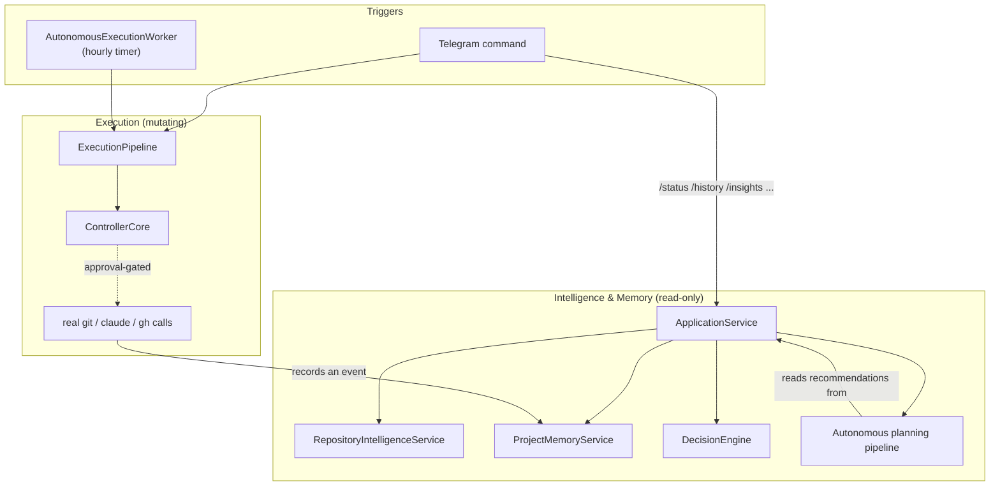
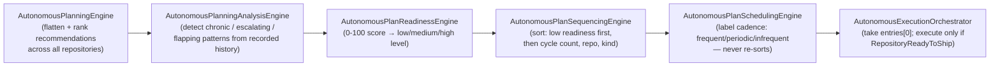

# System Design

> Companion to [architecture.md](./architecture.md) (principles, dependency graph, composition
> root) and [EXECUTION_PIPELINE.md](./EXECUTION_PIPELINE.md) (how a request actually executes).
> This document explains what the read-only intelligence/memory layer and the autonomous
> planning/execution subsystem actually compute and do, in enough detail to extend them
> safely. Every claim below is verified against the current implementation, including the
> places where the implementation is intentionally incomplete or currently unreachable.

## Two halves of the system



Everything in this codebase is one of two things: a **mutating** request that eventually
reaches `ControllerCore` through the approval gate (a real `git`/`claude`/`gh` invocation), or
a **read-only** query that reaches `ApplicationService` and never changes anything. The
autonomous planning pipeline is entirely read-only — it only becomes mutating at the single
seam described below.

## Intelligence & memory layer

### RepositoryIntelligenceService

Builds a `RepositorySnapshot` per repository, on every call (no caching), by running three
calls **concurrently** via `Promise.allSettled`: `GitAdapter.status()`,
`GitAdapter.getRecentCommits(5)`, and `GithubAdapter.listOpenPullRequests()`. Each of the
three can fail independently — a failure degrades only that section (empty commits list,
`"unknown"` branch, empty PR list) into a human-readable entry in `snapshot.health.issues`,
rather than failing the whole snapshot.

`RepositorySnapshot` contains: `repository` (id/name/path/defaultBranch), `branch`
(current/default/ahead/behind), `workingTree` (isClean/staged/unstaged/untracked),
`recentCommits` (last 5), `pullRequests` (open list + count), `health`
(`isGitRepository`/`isClean`/`hasUnpushedCommits`/`isBehindRemote`/`hasOpenPullRequests`/`issues`),
`workflowReadiness`, and `generatedAt`.

`workflowReadiness` additionally computes, using the *real* `ApprovalPolicy` (the same one
`ApprovalEngine` is built on, evaluated read-only here): `requiresApprovalBeforePush`,
`requiresApprovalBeforePullRequest`, `blockers` (e.g. "not a git repository" or "working tree
is clean and there are no unpushed commits"), and `canShip` (`blockers.length === 0`).
`canShip` is what ultimately drives the `RepositoryReadyToShip` recommendation described
below.

### ProjectMemoryService

Appends one JSON line per execution to `<memory.directory>/events.jsonl` — an
`ProjectMemoryEvent { id, recordedAt, repositoryId?, outcome }`, where `outcome` is either
`{kind: "result", result: ExecutionResult}` or `{kind: "error", error: string}` (only the
error's message is retained for error outcomes — the original task type is not, a known,
documented data limitation that affects `DecisionEngine`'s repeated-failure detection).
`getRecentEvents()` reads the whole file, revives ISO date strings back into `Date` objects
recursively, filters by repository, reverses to newest-first, and slices to a limit (default
20). No caching, no rotation — the file only grows for the process's lifetime.

`MemoryRecordingControllerCore` decorates `IControllerCore`, wrapping the **outermost** layer
(above `ApprovalEngine`) in the composition root, so every execution that crosses it —
standalone tasks, whole workflows, and each individual re-entrant workflow step — gets exactly
one recorded event. The write is fire-and-forget (`.catch(error => console.error(...))`) — a
failed memory write never affects the real result returned to the caller, and is never
retried.

### ClaudeSessionManager

A pure in-memory `Map<repositoryId, session>` — no adapter, no config, no disk I/O. Idle
timeout is 30 minutes, hardcoded. `resolveSession()` is the source of truth for whether the
next `ClaudeAdapter.execute()` call passes `{continue: true}`, and it's the only method that
actively evicts an expired record (`dropIfExpired`, called at the top of `resolveSession`). A
plain status query (`getSessionStatus()` — what `/session`, `DecisionEngine`, and
`StrategyEngine` all use) correctly *reports* `"expired"` once the timeout passes, but does
**not** delete the stale record — eviction only happens the next time that repository's
session is actually resolved (i.e. a real execution touches it again), or `resetSession()`
(`/session reset`) is called explicitly. In practice this is bounded by the (small,
config-driven) number of registered repositories, so it's a theoretical rather than practical
leak.

`SessionLifecycle.deriveSessionLifecycleState(info, hasActiveTask)` adds one pure,
presentational derivation on top — no new state of its own. It combines
`ClaudeSessionManager`'s own status with whether `ExecutionStateTracker` currently reports an
active task for that repository, into exactly one of four labels: `"none"` (no session record),
`"expired"` (the manager already flagged it), `"active"` (a record exists and a task is
currently running), or `"idle"` (a record exists, nothing running right now). `/session` uses
it to pick a status icon; nothing else consumes it.

`/session stop` (`ApplicationService.stopSession()`) composes `cancelCurrentTask()` (see
[Task cancellation](#task-cancellation) below) with `resetSession()`, capturing whether the
session was active before either write — a single command that both stops whatever is running
and clears the session record, rather than requiring `/task cancel` then `/session reset`
separately.

### DecisionEngine — Insight catalogue

`analyze(snapshot)` fetches recent memory events and session status once, then runs eight
independent detectors plus one composite meta-detector fed by the other eight's own output:

| Kind | Severity | Notification-worthy | Trigger |
|---|---|---|---|
| `unclean-working-tree` | warning | yes | working tree is not clean |
| `unpushed-commits` | info | no | `branch.ahead > 0` |
| `stale-branch` | warning | yes | `branch.behind > 5`, or most recent commit older than 14 days |
| `unfinished-workflow` | warning | yes | a recorded workflow-kind memory event with `status: "failed"` (one insight per matching event) |
| `repeated-failures` | warning, or **critical** if ≥4 occurrences | yes | ≥2 failed task results sharing a task type, or ≥2 failed workflow results sharing a workflow id, in recent history |
| `approval-required` | info | no | `workflowReadiness.requiresApprovalBeforePush` and/or `...BeforePullRequest` (up to two insights) |
| `open-pull-requests` | info | no | `pullRequests.openCount > 0` |
| `session-expired` | info | no | session status is `"expired"` |
| `risky-situation` | critical | yes | ≥2 of the above already have severity `warning`/`critical` — a meta-insight computed last, carrying `contributingKinds` |

`notificationWorthy` on every insight feeds `ProactiveMonitor` (below); `RepositoryInsightReport`
also exposes a pre-filtered `notificationWorthyInsights` list.

### ContextBuilder

Assembles an `ExecutionContext` (repository snapshot + up to 5 task-relevant recent memory
events + warnings). Consumed by `StrategyEngine.recommend()`, run concurrently with
`DecisionEngine.analyze()` — but only narrowly: `StrategyEngine.buildContextPolicy()` extracts
just two booleans (`includeRelevantHistory`, `relevantHistoryCount`) into `ContextPolicy`,
attaches it to `TaskExecutionStrategy`, and **nothing downstream reads it** — `PlanningEngine`
never inspects `.contextPolicy`. So `ContextBuilder`'s output is computed and partially
retained, but its effect on an actual execution decision, prompt, or user-visible output is
currently zero. See [Known gaps](#known-gaps-and-dormant-capabilities).

### RecommendationEngine and EngineeringAssistanceEngine

`RecommendationEngine.recommend(snapshot, insightReport, session)` is a pure, dependency-free
transform producing up to 6 `Recommendation` kinds, sorted critical → high → medium → low:

| Kind | Category | Priority | Trigger |
|---|---|---|---|
| `RepeatedFailures` | blocking | critical | a `repeated-failures` insight with severity `critical` |
| `ReviewChanges` | blocking (if `risky-situation`) or advisory | critical or medium | a `risky-situation` insight, or else a plain unclean-tree insight (mutually exclusive) |
| `PullRequired` | blocking | high | `branch.behind > 0` |
| `ReviewPullRequest` | advisory | high | `pullRequests.openCount > 0` |
| `RepositoryReadyToShip` | advisory | medium | `workflowReadiness.canShip` (mutually exclusive with `ContinueSession`) |
| `ContinueSession` | advisory | medium | not ready to ship, but a Claude session is active |

`EngineeringAssistanceEngine.propose(report)` is a pure 1:1 relabeling of that same report:
one `EngineeringProposal` per `Recommendation`, copying kind/category/priority/reason
verbatim and attaching a fixed action set looked up purely by `recommendationKind` (e.g.
`RepositoryReadyToShip` → Execute Ship Workflow / Inspect Repository / Dismiss). It never
recomputes anything and never calls `RecommendationEngine` itself — `ApplicationService` is
the only place the two are chained.

### ApplicationService — the read-only facade

Never implements `IControllerCore`, never calls `execute()`. Every method fetches its inputs
at most once and hands them to the appropriate engine — no method independently re-derives
data another method already computed in the same call. Full method list:

| Method | Returns |
|---|---|
| `getRepositoryStatus` | `RepositorySnapshot` |
| `getRepositoryHistory` | `ProjectMemoryEvent[]` |
| `getRepositoryInsights` | `RepositoryInsightReport` |
| `getSessionStatus` | `SessionReport` (session info + lifecycle state + current task) |
| `resetSession` | `string` — clears the session record (`/session reset`) |
| `stopSession` | `SessionStopOutcome` — cancels the current task, then clears the session (`/session stop`) |
| `getCurrentTask` | `CurrentTaskReport \| undefined` (`/task`) |
| `cancelCurrentTask` | `TaskCancellationOutcome` — see [Task cancellation](#task-cancellation) (`/task cancel`) |
| `undoLastExecution` | `Promise<UndoOutcome>` — see [Undo architecture](#undo-architecture) (`/undo`) |
| `getRecommendations` | `RepositoryRecommendationReport` |
| `getEngineeringAssistance` | `RepositoryAssistanceReport` |
| `getEngineeringWorkspace` | `EngineeringWorkspace` — the "everything at once" composed view: snapshot + insights + recommendations + assistance + session + recent history + attention events (if a monitor was wired) |
| `getAutonomousPlan` | `AutonomousPlan` (portfolio-wide, all repositories) |
| `getAutonomousPlanHistory` / `getLatestAutonomousPlanEvolution` / `getAutonomousPlanStates` / `getCurrentPlanState` / `getLivePlanComparison` / `getAutonomousPlanningSnapshot` / `getAutonomousPlanAnalysis` / `getAutonomousPlanReadiness` / `getAutonomousPlanSequence` / `getAutonomousPlanSchedule` | see [Autonomous planning & execution](#autonomous-planning--execution) |
| `getRuntimeStatus` / `getRuntimeControl` / `getRuntimeAdministration` / `getRuntimeDiagnosis` / `getRuntimeReport` | see [Runtime operations surface](#runtime-operations-surface) |
| `recordAutonomousPlanCycle` | the **only** write operation on this class |

## Autonomous planning & execution

This is actually **two subsystems** that meet at one narrow seam — worth understanding as two
things, not one pipeline:

1. **The descriptive planning pipeline** (`autonomy`, `plan`, `plananalysis`, `planhistory`,
   `planreadiness`, `plansequencing`, `scheduling`, `planrecording`, `planstate`) — every
   class in this cluster is, by construction, unable to execute anything: none can reach
   `ExecutionPipeline`, `ControllerCore`, git, GitHub, Claude, or Telegram. It only computes
   and (separately) records a ranked, annotated view of "what should happen."
2. **The execution-capable layer** (`autonomousexecution`, `runtime/AutonomousExecutionWorker`)
   — reads only the top-ranked entry of the descriptive pipeline's live output and, for
   exactly one recommendation kind, submits a real request into the same approval-gated
   `ExecutionPipeline` a human's `/ship` command uses.

### The descriptive chain (recomputed fresh on every call — no caching)



1. **`AutonomousPlanningEngine.buildPlan()`** — `ApplicationService.getAutonomousPlan()` fans
   `getRecommendations()` out across every registered repository via `Promise.allSettled` (one
   repository's failure doesn't abort the rest), flattens the results into `AutonomousPlanItem[]`,
   assigns a `PlanConfidence` (blocking→high, advisory→medium, informational→low), and sorts
   cross-repository by priority then category then repository id. A fresh `AutonomousPlan`
   with a new id, every call.
2. **`AutonomousPlanningAnalysisEngine.analyze()`** — reads recorded history (see below) and
   detects, per (repository, recommendation kind): **chronic** (≥5 consecutive cycles
   present), **sustained-escalation** (≥2 consecutive escalating cycles), **flapping**
   (reappeared as "new" more than once).
3. **`AutonomousPlanReadinessEngine.assess()`** — a heuristic 0-100 score per item: base
   100/60/20 by confidence, minus 30/20/10 for flapping/sustained-escalation/chronic. Bucketed
   into `low`/`medium`/`high` — only the bucket (`level`) is meant to be trusted by consumers;
   the raw score is explicitly non-contractual.
4. **`AutonomousPlanSequencingEngine.sequence()`** — sorts by: `low` readiness level first,
   then descending cycle count, then repository id, then recommendation kind. **This ordering
   is what ultimately decides which repository gets attempted for autonomous execution.**
5. **`AutonomousPlanSchedulingEngine.schedule()`** — labels each already-ordered entry with a
   cadence classification (`low`→frequent, `medium`→periodic, `high`→infrequent). A label
   only — never a real timer, and never re-sorts.

### Recording (the one persisted artifact)

`AutonomousPlanHistoryService` appends one `AutonomousPlanHistoryEntry {cycleNumber,
recordedAt, plan, evolution}` per cycle to `<memory.directory>/autonomous-plans.jsonl`
(append-only, never truncated — a sibling file to `events.jsonl`, same directory).
`AutonomousPlanEvolutionEngine.analyze()` diffs the new plan against the previous entry,
tagging each item `new`/`recurring`/`escalating`/`resolved`. Reads (`getLatestEntry()`/
`getHistory(limit)`) use bounded, chunked backward reads (64KB chunks) so cost scales with
`limit`, not total file size — this is the one place in the codebase where a
grows-forever-JSONL read pattern was already fixed (contrast with `ProjectMemoryService`,
which still reads the whole file every call).

Recording is triggered **only** by `AutonomousPlanRecordingWorker` — a 1-hour `setInterval`,
unconfigurable, unconditional: every tick calls `recordAutonomousPlanCycle()` regardless of
whether anything changed since the last cycle.

### The execution seam

**`AutonomousExecutionOrchestrator.attemptExecution(correlationId?)`**:
1. `scheduleProvider.getAutonomousPlanSchedule(1)` — re-runs the *entire* descriptive chain
   above, fresh. `limit: 1` only bounds how much recorded history feeds the analysis window,
   not how much work is done.
2. Takes `schedule.entries[0]` (already fully ordered — nothing here re-sorts). None → return
   `undefined`.
3. Translates it into a `PipelineRequest` **only if** `sourceRecommendationKind ===
   "RepositoryReadyToShip"` — every other kind returns `undefined`, no fallback, no partial
   attempt.
4. Submits `{kind: "pipeline", message: "autonomous-execution: ship <repo> (readiness
   <level>)", repositoryId, correlationId}` to `ExecutionPipeline.run()` — the same entry
   point, same Strategy→Planning→Coordination stack, same `"ship"` workflow, same
   `ApprovalEngine` gate that a human's `/ship <message>` command goes through. See
   [EXECUTION_PIPELINE.md](./EXECUTION_PIPELINE.md) for what happens next.

**`AutonomousExecutionWorker`** (1-hour `setInterval`, hardcoded) wraps this with one circuit
breaker: before attempting, it checks whether the target repository has a `ProjectMemoryEvent`
recorded within the last hour, and skips the attempt if so. This is a coarse proxy — "was
*anything* recently attempted for this repo," not an exact match on which recommendation — not
a precise dedup (memory events don't carry a recommendation kind to match against).

**`operator_chat_id` and fail-closed approval.** The worker forwards an opaque
`correlationId` — built once at startup from `config/telegram.yaml`'s `telegram.operator_chat_id`
via `buildTelegramCorrelationId(operatorChatId, 0)`, or `undefined` if that field isn't set —
into every `attemptExecution()` call, verbatim, without ever inspecting it. Downstream, when
an approval-gated step (`push-changes`/`create-pull-request`) is reached,
`TelegramApprovalProvider.requestApproval()` tries to parse this id back into a real Telegram
chat: if it isn't Telegram-shaped (the case whenever `operator_chat_id` is unset — which is
the current state of `config/telegram.yaml` in this repository), the request is **denied
immediately and synchronously**, with no prompt ever sent and no wait. If `operator_chat_id`
*is* configured, the composition root instead wires a `NotifyingAutonomousExecutionOrchestrator`
decorator (in `src/telegram/`) that, after any actual attempt (not on "nothing eligible"
ticks), sends the outcome to that chat — and a real approval prompt with buttons is what
reaches it for the gated step. See [TELEGRAM.md](./TELEGRAM.md#autonomous-execution-notifications).

### BackgroundRuntime workers

Hosted in a fixed array set at composition-root construction time, started unconditionally
(before the `telegram.enabled` check):

| Worker | Interval | Per tick |
|---|---|---|
| `MonitoringWorker` | 15 min | Per repository: ask `RuntimePolicyEngine.evaluateMonitoring()`; if allowed, `ProactiveMonitor.evaluate()` then `AttentionDispatcher.dispatch()` |
| `AutonomousPlanRecordingWorker` | 1 hour | `recordAutonomousPlanCycle()`, unconditionally |
| `AutonomousExecutionWorker` | 1 hour | described above |
| `HealthCheckWorker` *(Stage 4)* | 1 min | writes `memory.directory/health.json` — a liveness heartbeat only, no business logic; see [DEPLOYMENT.md](./DEPLOYMENT.md#health-checks) |

All four: re-entrancy guarded (a tick still running when the next timer fires is skipped, not
overlapped), errors caught and logged (never rethrown, never stop the timer), `.unref()`'d
(never the reason the process stays alive on their own — `BackgroundRuntime` holds its own
24-hour `ref()`'d keep-alive interval for that). `BackgroundRuntime.stop()` stops every worker
with independent per-worker error isolation.

**MonitoringWorker → AttentionDispatcher detection.** `ProactiveMonitor.evaluate()` calls
`getRecommendations()` and reconciles against `RecommendationStateStore` — one state per
(repository, recommendation kind) tracking first/last seen and whether an alert was already
delivered. Two triggers: `"new-urgent-recommendation"` (fires once, first time a
recommendation is blocking or critical/high priority) and `"sustained-recommendation"` (fires
once, when any recommendation has been continuously present for ≥1 hour). A recommendation
disappearing and reappearing resets its streak. `AttentionDispatcher.dispatch()` groups events
by repository, checks `RuntimePolicyEngine.evaluateNotification()` per group before delivering
to any registered transport (Telegram, if enabled), and records a "notification sent" against
policy once per allowed attempt — regardless of whether the transport call itself succeeds, so
a broken transport can't defeat rate limiting by silently never "succeeding."

### RuntimePolicyEngine governance (hardcoded, not YAML-configurable)

```
quietHours: { startHour: 22, endHour: 7 }   // local server time
cooldownMs: 30 minutes                       // per repository
maxNotificationsPerInterval: 5               // global, across all repositories
notificationIntervalMs: 1 hour               // rolling window
```

`evaluateMonitoring()` denies on quiet hours → maintenance mode → repository explicitly
disabled, in that order. `evaluateNotification()` denies on quiet hours → maintenance mode →
per-repository cooldown → global rate limit, in that order. Two independent gates — cooldown
alone can't cover a simultaneous multi-repository alert storm, and the global limit alone
can't rate-limit one chatty repository fairly against others.

### Human-in-the-loop safeguards

1. **`ApprovalPolicy` config gate** — as long as `approval.mode: manual` (the shipped
   default) and the task's type is listed in `approval.require_before` (shipped as
   `[push-changes, merge]`), that step requires approval, autonomous or not. Since
   `shipWorkflow` aborts on first failure, a denied push means `create-pull-request` never
   runs either.
2. **Fail-closed correlationId** — described above: with no `operator_chat_id` configured (the
   current shipped state), autonomous execution can synthesize and strategize a request but
   can never complete a real push/PR, because the approval step is denied synchronously.
3. **`RuntimeControlService.pauseMonitoring()`** calls `BackgroundRuntime.stop()`, which today
   stops all four workers — including `AutonomousExecutionWorker` — functioning as a real
   kill switch. (Its own code comment is stale, still describing a Phase-8-era world where
   `MonitoringWorker` was the only hosted worker; the actual current wiring includes all
   four.) `enterMaintenanceMode()` blocks monitoring/notification evaluation but does **not**
   by itself stop autonomous execution attempts, since `AutonomousExecutionWorker` never
   consults `RuntimePolicyEngine` at all.
4. Every mutating action, however triggered and whatever its outcome, is still durably
   recorded to Project Memory via `MemoryRecordingControllerCore`.

### Task cancellation

`/task cancel` (`ApplicationService.cancelCurrentTask()`) is cooperative, not a hard kill, and
only some task types can even be asked:

1. Reads the current execution snapshot from `ExecutionStateTracker` (via
   `IExecutionStateReader`); nothing running → `"nothing-running"`.
2. If that execution is currently **awaiting approval** (checked against
   `TelegramApprovalProvider`'s pending map via `IApprovalPendingReader`), cancellation means
   rejecting the approval request instead of touching `TaskPlanner` at all — an awaiting-
   approval task and a running task are two structurally different things to stop.
3. Otherwise, checks `TaskCancellationPolicy.canCancel(taskType)` — only `analyze-repository`,
   `review-code`, `explain-code`, `implement-feature`, and `fix-bug` are cancellable, because
   these are the only five workflows whose `AbortSignal` is actually observed (they forward it
   into `ClaudeAdapter.execute()`, which kills the underlying `claude` child process on abort —
   see [EXECUTION_PIPELINE.md](./EXECUTION_PIPELINE.md#abortsignal-handling)). Any other
   in-progress task type → `"not-cancellable"`.
4. If cancellable, calls `TaskPlanner.cancel(correlationId)` — the same per-run
   `AbortController` the execution timeout itself would trigger, just aborted early with a
   `TaskCancelledError` instead of a timeout, so the caller can tell "cancelled" apart from
   "timed out." Returns `"cancelled"`, or re-checks execution state to distinguish
   `"already-cancelling"` from `"already-finished"` if the task completed in the interim.

`TaskPlanner` itself is purely mechanical here — `cancel()` never inspects or judges what it's
cancelling, it only aborts the matching controller if one exists.

## Undo architecture

`/undo` reverses the most recent **file-editing** task only — `implement-feature` and
`fix-bug` (`UndoableTaskPolicy`); deterministic git operations (commit/push/PR/branch/merge)
are a distinct concern, explicitly out of scope for `/undo`.

**Checkpointing.** `TaskPlanner` captures a git tree snapshot (`GitAdapter.createSnapshot()`,
via `UndoCheckpointRecorder`) both immediately before and immediately after every undoable
task's execution — on every exit path (success, thrown error, timeout, or cancellation).
Snapshot capture failure is swallowed so it can never fail the actual task. The resulting
`{beforeSnapshot, afterSnapshot, taskType, correlationId, capturedAt}` checkpoint is attached
to the `TaskResult` and persisted as part of the normal execution-history event stream by
`ProjectMemoryService` — there is no separate undo store. Only the single most recent
not-yet-undone checkpoint is ever reachable; there is no multi-level undo stack or configurable
depth.

**`/undo`, two phases (`IUndoService`):**
1. `buildUndoPlan()` — refuses immediately if `ExecutionStateTracker` reports anything
   currently running for the repository (`"execution-in-progress"`, never touches files
   mid-execution). Otherwise finds the most recent undoable, not-yet-undone checkpoint (`
   "nothing-to-undo"` if none). Diffs `beforeSnapshot` vs `afterSnapshot`
   (`GitAdapter.diffChangedFiles()`) to compute which paths to restore vs delete, then takes a
   **fresh live snapshot** and diffs `afterSnapshot` against it — if anything the task touched
   has changed since (e.g. a manual edit, or a later task touching the same files), the plan is
   `"drift-detected"` and undo is blocked, listing the conflicting files.
2. `executeUndoPlan()` — only proceeds if the plan's status is `"ready"`; otherwise throws.
   Calls `GitAdapter.restorePaths(beforeSnapshot, filesToRestore, filesToDelete)`, then records
   an `"undo"` event referencing the checkpoint (the original event is never mutated).

An undo failure (e.g. `restorePaths` itself throwing) propagates as a normal thrown error up to
the Telegram layer — only the three named non-error outcomes above (`nothing-to-undo`,
`execution-in-progress`, `drift-detected`) are handled as expected, formatted results.

## Runtime operations surface

`getRuntimeReport()` fetches `RuntimeStatus` once (a pure read-only composition of
`BackgroundRuntime.getStatus()` + `MonitoringWorker.getStatus()` + `AttentionDispatcher.getStatus()`
+ `RuntimePolicyEngine.getStatus()`), builds `RuntimeDiagnosticsReport` from it once
(`RuntimeDiagnosticsEngine.diagnose()`), then `RuntimeReportingEngine.buildReport()` produces
one `RuntimeReport` with 6 fixed sections: Runtime, Workers, Monitoring, Policy, Attention,
Findings.

Telegram's five `/runtime *` commands (`report`/`status`/`diagnostics`/`monitoring`/`policy`)
do **not** call five different `ApplicationService` methods — every one calls
`getRuntimeReport()` and a different `ResponseFormatter` method selects a different subset of
that *same* report's sections. No case recomputes anything independently.

`RuntimeControlService` — the one class in this cluster with real mutation capability:
`pauseMonitoring`/`resumeMonitoring` (start/stop `BackgroundRuntime`), `enterMaintenanceMode`/
`exitMaintenanceMode`, `enableRepository`/`disableRepository`, `resetDispatcherStatistics`,
`resetRuntimeStatistics` — 8 methods, each one delegating call, no state of its own.
`RuntimeAdministrationService` is a read-only facade that can hand back a
`RuntimeControlService` reference via `getControl()`, but never calls a mutating method
itself.

## Known gaps and dormant capabilities

Documented explicitly here so a future contributor doesn't assume these are either bugs or
missing — they're implemented, correct, and simply not wired to anything that can trigger
them yet:

- **`RuntimeControlService`'s 8 mutating methods are fully implemented and reachable via
  `ApplicationService.getRuntimeControl()`, but no Telegram command (or any other front-end)
  calls any of them.** There is no `/pause`, `/maintenance`, or `/disable` command. The
  capability — including a genuine kill switch for autonomous execution — exists but is not
  currently operator-triggerable.
- **`ContextBuilder`'s output is computed but not meaningfully consumed** — see
  [ContextBuilder](#contextbuilder) above. `StrategyEngine` keeps only two derived booleans,
  and nothing reads them further downstream.
- **The five Claude-backed workflows observe their `AbortSignal`; every git/GitHub-only
  workflow still ignores it.** `TaskPlanner` threads an `AbortSignal` into every workflow call
  (for both timeout and `/task cancel` to abort), but only `analyze-repository`, `review-code`,
  `explain-code`, `implement-feature`, and `fix-bug` forward it into `ClaudeAdapter.execute()`,
  which kills the underlying process on abort. For every other task type, on timeout the
  underlying git/GitHub call keeps running in the background, unobserved — matching exactly
  the task types `TaskCancellationPolicy` already excludes from `/task cancel` for the same
  reason. See [EXECUTION_PIPELINE.md](./EXECUTION_PIPELINE.md#abortsignal-handling) and
  [Task cancellation](#task-cancellation) above.
- **`ProjectMemoryService.getRecentEvents()` re-reads and re-parses the entire `events.jsonl`
  file on every call**, including from the hourly `AutonomousExecutionWorker` tick — unlike
  `AutonomousPlanHistoryService`, which already solves the identical problem with a bounded
  tail read.
- **`notifications.task_started`/`task_completed`/`task_failed`** in `config/telegram.yaml`
  are validated on load but not read anywhere else in the codebase — declared, but currently
  inert.
- **`logging.enabled`/`logging.level`/`logging.directory`** in `config/controller.yaml` are
  validated but never consulted by any actual logging call site — all current logging goes to
  stdout/stderr (`console.log`/`console.error`, or Telegram's own structured `logEvent()`
  helper), never to a file. See [CONFIGURATION.md](./CONFIGURATION.md#unused-fields) and
  [DEPLOYMENT.md](./DEPLOYMENT.md#logging).
