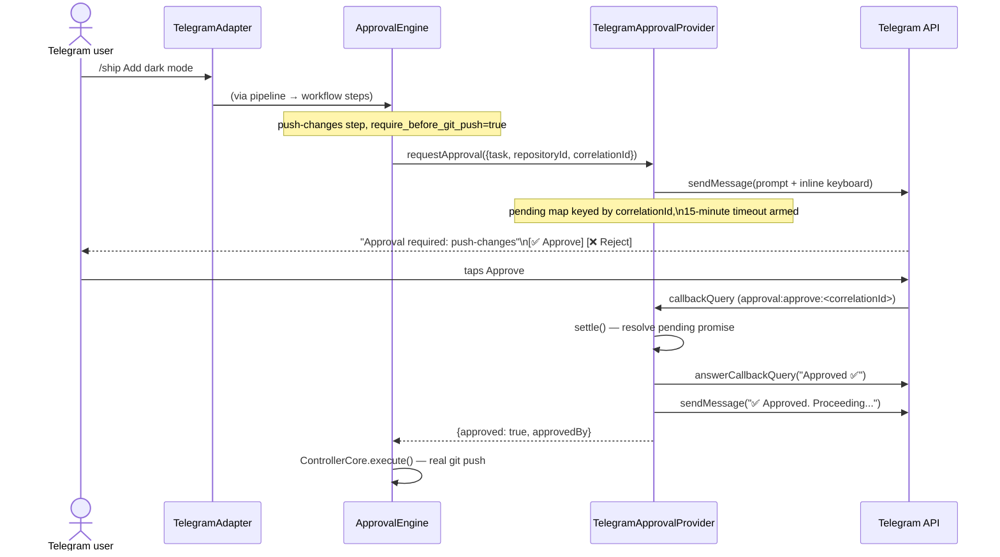

# Telegram Transport

> Companion to [EXECUTION_PIPELINE.md](./EXECUTION_PIPELINE.md) (what each command actually
> does once submitted) and [CONFIGURATION.md](./CONFIGURATION.md) (full field validation for
> `config/telegram.yaml`).

## Command reference

Parsing (`CommandParser.parse()`): a leading `/` is optionally stripped; an optional
`repo=<id>` **prefix** (must come before the command name, e.g. `/repo=my-repo status`) sets
the target repository; the remaining text splits into command name + args.

| Command | Kind | Notes |
|---|---|---|
| `/analyze [focus text]` | task | args optional |
| `/explain <target>` | task | args required |
| `/implement <description>` | task | args required |
| `/fix <description>` | task | args required |
| `/commit <message>` | task | args required |
| `/push` | task | no args |
| `/create-pr <title>` | task | args required |
| `/list-prs` | task | no args |
| `/ship <message>` | **workflow** → becomes a `pipeline`-kind request, distinct from `/commit` even though both build a `create-commit` task shape | args required |
| `/auto-execute` | autonomous-execute | directly invokes `AutonomousExecutionOrchestrator.attemptExecution()`; no repo/args of its own |
| `/status [repo=<id>]` | query | |
| `/history [N]` | query | N must be a positive integer if given |
| `/insights` | query | |
| `/session` | query | |
| `/runtime` or `/runtime report` | query | bare `/runtime` normalizes to `report` |
| `/runtime status` / `diagnostics` / `monitoring` / `policy` | query | see [SYSTEM_DESIGN.md](./SYSTEM_DESIGN.md#runtime-operations-surface) — all five select different sections of the same underlying report |

Any other command → `CommandParseError`: `Sorry, I don't recognize the command "<name>"`,
sent back as a plain reply. A missing required argument produces a specific message (e.g.
`"implement" requires a description.`), not a generic error.

## Authorization

`TelegramSecurity.isAuthorized(userId)` checks the stringified numeric user id against
`config/telegram.yaml`'s `security.allowed_users`. Enforced at two independent points, both
mandatory:

1. **Every command**, including `/auto-execute` and every `/runtime *` query — the very first
   thing `TelegramAdapter.handleUpdate()` does, before parsing. Unauthorized → `"You are not
   authorized to use this bot."`, nothing further happens.
2. **Every approval button press** — `TelegramApprovalProvider.handleCallback()` checks
   independently, after matching the callback data but before touching the pending-approval
   map. Unauthorized → a toast reading `"You are not authorized to approve this."`; the
   approval is not settled.

## Approval flow

`requestApproval(request)`:
1. Parses `correlationId` against `^telegram:(-?\d+):(\d+)$`. No match (e.g. an internally
   generated id from a non-Telegram trigger with no `operator_chat_id` configured) → **fails
   closed immediately**: `{approved: false, reason: "Cannot request Telegram approval:
   correlationId was not created by the Telegram transport."}` — no message sent, no wait.
2. Otherwise: arms a 15-minute timeout (`APPROVAL_TIMEOUT_MINUTES`, hardcoded, not currently
   YAML-configurable), registers the pending entry, and sends the prompt:
   `Approval required: "<task.type>"[ in repository "<repositoryId>"].\n\nApprove or reject?`
   with an inline keyboard (`✅ Approve` / `❌ Reject`), callback data `approval:approve:<id>` /
   `approval:reject:<id>`.
3. On timeout: denies with `"Approval request timed out after 15 minute(s)."`.
4. If the prompt itself fails to send: denies with `"Failed to send the Telegram approval
   prompt."`.

On button press (`handleCallback`): unmatched callback data is silently ignored; an
already-resolved/expired correlationId gets `"This request is no longer awaiting approval."`;
otherwise the decision settles as `{approved: true, approvedBy: userId}` or `{approved: false,
reason: "Rejected by Telegram user <userId>."}`, a toast confirms it, and a separate chat
message confirms it in text.

**Restart behavior**: pending approvals live only in an in-memory `Map`. A controller restart
loses any request not yet decided — the original caller's promise is never resolved after a
restart (its own timer died with the process too), and a late button press against the old
correlationId hits the "no longer awaiting approval" branch in the new process.

## Autonomous execution notifications

`NotifyingAutonomousExecutionOrchestrator` decorates the plain orchestrator: forwards
`attemptExecution()` unchanged, and — only when a real attempt happened (not on "nothing
eligible" ticks) — sends `ResponseFormatter.formatAutonomousExecutionResult(result)` to
`operator_chat_id`. A failed notification send is caught and logged, never affects the
returned result. The composition root chooses this decorator over the plain orchestrator
**iff** `operator_chat_id` is configured; see
[SYSTEM_DESIGN.md](./SYSTEM_DESIGN.md#the-execution-seam) for the fail-closed behavior when
it isn't.

## Long-polling mechanics

Each `getUpdates` call is a genuine 30-second server-side long poll (not a client-side sleep
loop). `offset` advances past every update received (Telegram's own ack). Updates are
dispatched fire-and-forget (`void processUpdate(update)`, never awaited) so one slow update
(e.g. blocked on an approval round-trip) never delays fetching the next batch — each call
catches its own errors internally, so this can't produce an unhandled rejection. A fetch
failure backs off 2 seconds before retrying. `stop()` aborts any in-flight long-poll
immediately via `AbortController`, so shutdown doesn't wait up to 30 seconds.

## Message length

Telegram's hard limit is 4096 characters; the project splits at 4000 (`TELEGRAM_MAX_MESSAGE_LENGTH`)
to leave margin for multi-byte characters. `splitMessageText()` prefers breaking on the last
newline at or before the limit, falling back to a hard cut only if none exists. Only the
**final** chunk of a split message carries an inline keyboard, so approval buttons never
appear more than once for one logical reply.

## `config/telegram.yaml` fields

See [CONFIGURATION.md](./CONFIGURATION.md#configtelegramyaml) for full validation rules. In
brief:

| Field | Purpose |
|---|---|
| `telegram.enabled` | gates whether the long-polling transport/adapter start at all — the approval-gated execution stack and `AutonomousExecutionWorker` run regardless, see [architecture.md](./architecture.md#composition-root) |
| `telegram.operator_chat_id` *(optional)* | destination for autonomous-execution notifications and the chat a fail-open approval prompt would route to |
| `bot.token` | Bot API token, normally supplied via `${TELEGRAM_BOT_TOKEN}` env interpolation |
| `security.allowed_users` | the authorization allowlist (§Authorization); its **first** entry also doubles as the destination for proactive monitoring alerts (`TelegramAttentionTransport`) — an empty list throws `NoNotificationRecipientConfiguredError` the first time an alert tries to deliver |
| `notifications.task_started` / `task_completed` / `task_failed` | validated on load but **not read anywhere else in the codebase** — currently inert |

## Error/response behavior

| Situation | Response |
|---|---|
| Unauthorized user | fixed friendly string |
| Unrecognized/malformed command | specific, purpose-built `CommandParseError` message |
| A query, task, or `/auto-execute` throws | `Something went wrong: <message>` (raw) |
| A task/workflow runs but fails (not a thrown exception) | structured, friendly text via `ResponseFormatter` (e.g. `Task "push-changes" failed: <reason>`) |
