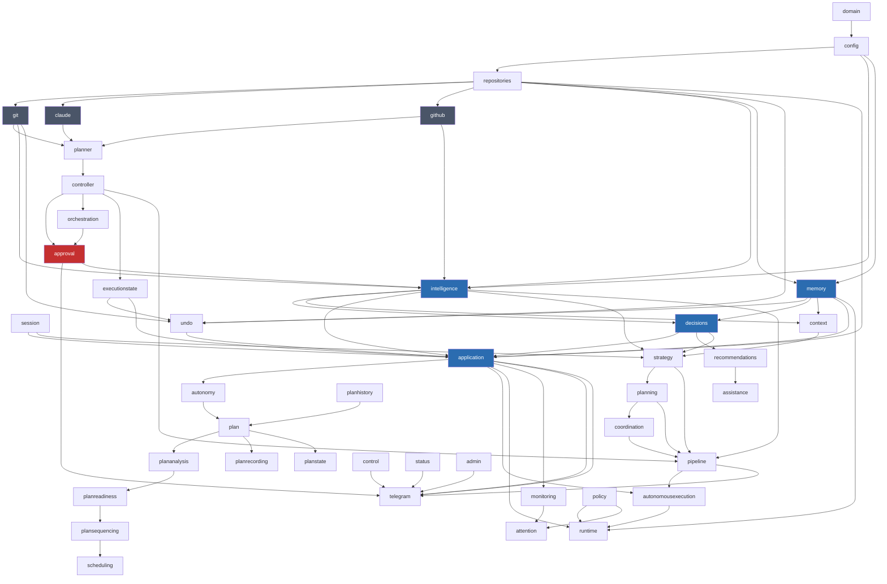
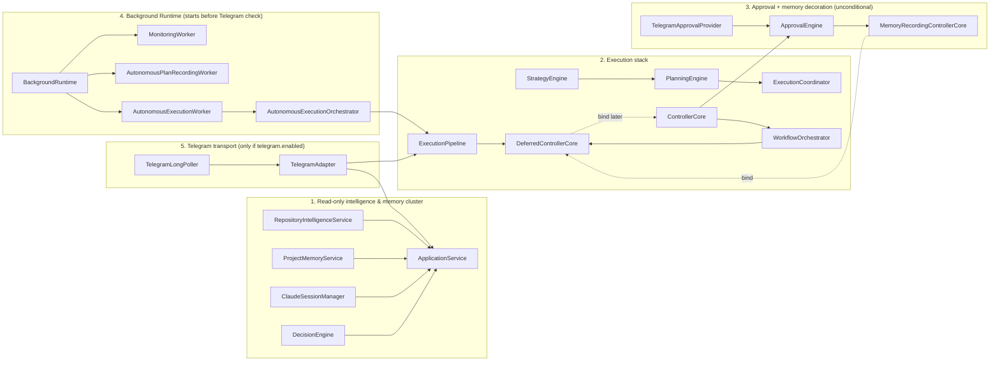

# Architecture

> This document covers system-wide principles, the module dependency graph, and the
> composition root. For what each subsystem actually does at the class/method level, see
> [SYSTEM_DESIGN.md](./SYSTEM_DESIGN.md) (intelligence, memory, autonomous planning/execution)
> and [EXECUTION_PIPELINE.md](./EXECUTION_PIPELINE.md) (request routing, approval gating,
> workflows). For the Telegram transport specifically, see [TELEGRAM.md](./TELEGRAM.md). For
> configuration, see [CONFIGURATION.md](./CONFIGURATION.md).

## Principles

- **Interfaces first.** Every module exposes an `I*` interface as its public contract.
  Consumers depend on the interface, never on the concrete class or on the module's
  internal implementation details (YAML parsing, shelling out to `git`/`claude`/`gh`, HTTP
  calls to Telegram, ...).
- **One class, one job.** File-transport/process-execution is isolated behind exactly one
  class per module (`YamlConfigLoader`, `GitCommandRunner`, `ClaudeProcessRunner`,
  `TelegramApiClient`) — nothing else in the codebase touches `fs`, `child_process`, or
  `fetch` directly. Verified: outside `src/config/`, only `src/index.ts` (the `.env` existence
  check, unavoidable before `ConfigService` can exist) and `src/repositories/RepositoryValidator.ts`
  (confirming a registered repository's path/`.git` directory exist — a repository-domain
  concern, not config-reading) touch `node:fs` at all.
- **Mechanism vs. policy.** Adapters (`GitAdapter`, `ClaudeAdapter`, `GithubAdapter`), the
  planner, and `ControllerCore` never read approval configuration and never decide whether an
  action is *allowed* — they only know how to *do* it. Exactly one module (`ApprovalEngine`)
  owns approval policy, implemented as a decorator around `IControllerCore` so gating any
  front-end — or any *trigger*, including the autonomous execution worker — is a composition-time
  choice, not a code change. This decorator is applied unconditionally in the composition
  root (see [Composition root](#composition-root)), so it is never possible to reach
  `ControllerCore` from any live code path without also passing through `ApprovalEngine`.
- **Fail fast, fail clearly.** Every module defines its own typed errors with
  human-readable messages (missing config file, invalid YAML, repository path doesn't
  exist, git command failed, unknown task type, ...) rather than letting raw
  `ENOENT`/parser exceptions leak out.
- **Descriptive vs. execution-capable, kept explicitly separate.** The autonomous-planning
  module family (`autonomy`, `plan`, `plananalysis`, `planhistory`, `planreadiness`,
  `plansequencing`, `scheduling`, `planrecording`, `planstate`) is, by construction, incapable
  of executing anything — none of these classes can reach `ExecutionPipeline`, `ControllerCore`,
  `ApprovalEngine`, git, GitHub, Claude, or Telegram. Exactly one class,
  `AutonomousExecutionOrchestrator` (`src/autonomousexecution/`), is the seam where a
  read-only, recomputed-on-demand recommendation becomes a real, approval-gated execution
  request. See [SYSTEM_DESIGN.md](./SYSTEM_DESIGN.md#autonomous-planning--execution) for the
  full data flow.

## Layered dependency graph

Verified acyclic (zero real, value-level circular imports found via a full graph traversal)
across all 46 `src/` modules (44 from the original phases, plus Stage 4's `src/startup/`, plus
`src/executionstate/` and `src/undo/` from the Undo/Task Cancellation phase), not just the
original execution pipeline:

*(This diagram groups related low-traffic modules for readability — `status`, `control`,
`admin`, `diagnostics`, `reporting` are the runtime-operations cluster described in
[SYSTEM_DESIGN.md](./SYSTEM_DESIGN.md#runtime-operations-surface); the full 44-module edge
list is larger than is useful to render directly.)*

- **`domain`** — the shared `Repository` type used by every module above it.
- **`config`** — `ConfigService` reads and validates `config/*.yaml`. Nothing else in the
  codebase reads YAML or touches the `config/` directory directly. See
  [CONFIGURATION.md](./CONFIGURATION.md) for the full schema.
- **`repositories`** — `RepositoryRegistry` turns `ConfigService.getRepositories()` into a
  validated, queryable lookup (each repository's path must exist and contain a `.git`
  directory before it's considered registered).
- **`git` / `claude` / `github`** — one adapter per external process (`git`, `claude`, `gh`
  CLI), each the sole owner of shelling out to that tool. All three use array-argument
  `execFile`/`spawn` (never a shell string), so no command-injection risk exists even though
  prompt/message/title text can originate from user-controlled Telegram input.
- **`planner`** — `TaskPlanner` dispatches a `Task` to one small workflow class per task
  type, built by `WorkflowFactory`. Enforces `ControllerConfig.task`'s concurrency limit and
  per-task timeout. See [EXECUTION_PIPELINE.md](./EXECUTION_PIPELINE.md#task-types-and-workflows).
- **`controller`** — `ControllerCore` is the single entry point that actually executes a
  `Task` or a workflow: resolve the repository, delegate to `TaskPlanner` or
  `WorkflowOrchestrator`, return an `ExecutionResult`.
- **`orchestration`** — `WorkflowOrchestrator` runs a named multi-step `WorkflowDefinition`
  (today: only `"ship"`) as a sequence of individual `Task`s, each re-entering through the
  *same* top-of-stack `IControllerCore` the orchestrator itself was built against — this is
  what makes per-step approval gating (rather than gating the workflow as a whole) work. See
  [EXECUTION_PIPELINE.md](./EXECUTION_PIPELINE.md#workfloworchestrator--the-ship-workflow).
- **`approval`** — `ApprovalEngine implements IControllerCore`, wrapping a real one. Reads
  `ControllerConfig.approval` to decide whether a request needs approval, and — if so —
  awaits an `IApprovalProvider` before ever calling the wrapped `ControllerCore`.
- **`telegram`** — `TelegramAdapter` parses a message into a pipeline/query request, submits
  execution requests to `IExecutionPipeline`, submits queries to `IApplicationService`, and
  sends the formatted result back. Knows nothing about git, Claude, YAML, or the planner's
  internals. See [TELEGRAM.md](./TELEGRAM.md).
- **`intelligence`** — `RepositoryIntelligenceService` builds a `RepositorySnapshot`
  concurrently via `Promise.allSettled` over `GitAdapter.status()`, `GitAdapter.getRecentCommits()`,
  and `GithubAdapter.listOpenPullRequests()` — a failure in any one source degrades only that
  section of the snapshot rather than failing the whole snapshot.
- **`memory`** — `ProjectMemoryService` appends one JSON line per execution to
  `memory.directory/events.jsonl` and reads them back newest-first. `MemoryRecordingControllerCore`
  decorates `IControllerCore` exactly like `ApprovalEngine` does — it never changes the
  outcome it wraps; a failed memory write is caught and logged, never surfaced to the caller.
- **`session`** — `ClaudeSessionManager` is a pure in-memory metadata/policy store (no
  adapter, no config, no `fs`): one record per repository, expired after 30 minutes of
  inactivity, evicted lazily (only when that repository's session is resolved again — a
  status query alone does not evict a stale record). `SessionLifecycle` adds one pure,
  presentational derivation (`deriveSessionLifecycleState`) on top, combining a session
  record's status with `executionstate`'s own "is anything running" fact — no new state of
  its own. See [SYSTEM_DESIGN.md](./SYSTEM_DESIGN.md#claudesessionmanager).
- **`executionstate`** — `ExecutionStateTracker implements IControllerCore`, decorating a
  real one purely to track *metadata* about what's currently executing (repository,
  correlationId, task/workflow type, current step, start time, re-entrancy depth) in an
  in-memory map — never an `AbortController` or an adapter reference. Read by
  `ApplicationService` (`/task`, `/task cancel`, `/undo`) via `IExecutionStateReader`.
- **`undo`** — `UndoService` reverses the most recent `implement-feature`/`fix-bug` task's
  file changes only, using `GitAdapter`'s snapshot/diff/restore plumbing plus the same
  execution-state and project-memory facts every other read-side query already uses. See
  [SYSTEM_DESIGN.md](./SYSTEM_DESIGN.md#undo-architecture) for the full two-phase flow.
- **`decisions`** — `DecisionEngine.analyze()` combines a repository's snapshot and recent
  `ProjectMemoryEvent`s into 9 typed `Insight` kinds. See
  [SYSTEM_DESIGN.md](./SYSTEM_DESIGN.md#decisionengine--insight-catalogue) for the full table.
- **`context`** — `ContextBuilder.build()` assembles an `ExecutionContext` (repository
  snapshot plus task-relevant `ProjectMemoryEvent`s), consumed by `StrategyEngine` — but only
  narrowly: two derived booleans (`includeRelevantHistory`, `relevantHistoryCount`) are kept
  as `ContextPolicy`, and `ContextPolicy` itself is not read by anything further downstream
  today (`PlanningEngine` never inspects it). See
  [SYSTEM_DESIGN.md](./SYSTEM_DESIGN.md#known-gaps-and-dormant-capabilities).
- **`application`** — `ApplicationService` is the read-only query facade: it never implements
  `IControllerCore` and never calls `execute()`. It fans out to `intelligence`/`memory`/
  `decisions`/`session`/the autonomous-planning cluster/the runtime-operations cluster for
  every read-side Telegram command.
- **`strategy` / `planning` / `coordination` / `pipeline`** — the decision-support stack that
  turns a `Task` into a `TaskExecutionStrategy` (`StrategyEngine`), an `ExecutionPlan`
  (`PlanningEngine`), and a `CapabilityProgram` (`ExecutionCoordinator`), which
  `ExecutionPipeline` finally dispatches into `ControllerCore`. Full detail, including which
  requests bypass this stack, is in [EXECUTION_PIPELINE.md](./EXECUTION_PIPELINE.md).
- **`autonomy` / `plan` / `plananalysis` / `planhistory` / `planreadiness` / `plansequencing`
  / `scheduling` / `planrecording` / `planstate`** — the descriptive autonomous-planning
  pipeline: recomputes a ranked, annotated view of "what should happen next" across every
  repository, on demand, every time it's asked. None of these classes can execute anything.
  See [SYSTEM_DESIGN.md](./SYSTEM_DESIGN.md#autonomous-planning--execution).
- **`autonomousexecution`** — `AutonomousExecutionOrchestrator`, the one class that reads the
  descriptive pipeline's top-ranked entry and, only for `RecommendationKind ===
  "RepositoryReadyToShip"`, submits it into the same `ExecutionPipeline` a human's `/ship`
  command uses.
- **`runtime`** — `BackgroundRuntime` hosts four always-on workers (`MonitoringWorker`,
  `AutonomousPlanRecordingWorker`, `AutonomousExecutionWorker`, and — Stage 4 operational
  hardening — `HealthCheckWorker`, a dependency-free liveness heartbeat writer), started
  unconditionally at bootstrap regardless of whether the Telegram transport itself is enabled.
- **`monitoring` / `attention` / `policy`** — proactive detection (`ProactiveMonitor`),
  delivery (`AttentionDispatcher`), and governance (`RuntimePolicyEngine`: quiet hours,
  per-repository cooldown, global notification-rate limit) for unsolicited alerts.
- **`status` / `control` / `admin` / `diagnostics` / `reporting`** — the runtime-operations
  query/administration surface, exposed today only as five read-only `/runtime *` Telegram
  commands. `RuntimeControlService`'s mutating methods (`pauseMonitoring`,
  `enterMaintenanceMode`, `enableRepository`, ...) are fully implemented and wired through
  `ApplicationService.getRuntimeControl()`, but **no live entry point calls them today** — see
  [SYSTEM_DESIGN.md](./SYSTEM_DESIGN.md#known-gaps-and-dormant-capabilities).

## Composition root

`src/index.ts` is the only file that constructs concrete, cross-module collaborators and
wires them together. Two narrow, documented exceptions exist — `RepositoryIntelligenceService`
and `WorkflowFactory` each construct their own `GitAdapter`/`ClaudeAdapter`/`GithubAdapter`
per call, because those adapters are parameterized by a `repositoryId` only known at request
time, not at bootstrap. No other module reaches past its declared interface dependencies to
construct its own collaborators from another module.

Construction order matters because several real, construction-time dependency cycles exist —
not type-only cycles, but genuine "A needs B, B needs A" situations — and the codebase
resolves every one of them with the same pattern: an unbound `Deferred*` stand-in
(`DeferredControllerCore`, `DeferredRuntimeStatusService`, `DeferredRuntimeControlService`,
`DeferredRuntimeAdministrationService`) is constructed first, handed to whatever needs "the
real thing eventually," and `.bind(realInstance)` is called once the real instance exists —
always synchronously, before any request can reach it. Calling a `Deferred*` method before
`bind()` throws a dedicated `*NotBoundError`.

The Task Cancellation/Undo/Approval phases added four more seams of the same shape —
`DeferredTaskCanceller`, `DeferredExecutionStateReader`, `DeferredApprovalCanceller`, and
`DeferredApprovalPendingReader` — each because `ApplicationService` is constructed before the
real collaborator it needs (`TaskPlanner`, the fully-decorated `ControllerCore` stack, and
`TelegramApprovalProvider`, respectively) exists. Their own doc comments are explicit that most
of these aren't genuine cycles the way `DeferredControllerCore`'s is — just the identical
construction-order constraint, solved with the same seam for consistency.

Construction happens in five groups, in this order:

1. **Read-only intelligence & memory cluster** — `RepositoryIntelligenceService`,
   `ProjectMemoryService`, `ClaudeSessionManager`, `DecisionEngine`, and `ApplicationService`
   (with its `Deferred*` runtime-operations seams still unbound) — none of it depends on the
   execution stack.
2. **Execution stack** — `StrategyEngine → PlanningEngine → ExecutionCoordinator`,
   `WorkflowFactory → TaskPlanner`, `WorkflowOrchestrator` (built against the still-unbound
   `DeferredControllerCore`), `ExecutionPipeline` (built against that same seam).
3. **Approval + memory decoration, applied unconditionally.** `telegramClient` and
   `telegramSecurity` are constructed here (not later, inside a Telegram-only branch) because
   `TelegramApprovalProvider` needs them, and `TelegramApprovalProvider` is now needed
   *unconditionally* — `ApprovalEngine(plainControllerCore, ...)` wrapped by
   `MemoryRecordingControllerCore` is bound to `DeferredControllerCore` **before** the
   `telegram.enabled` check runs. This closes a real gap: `BackgroundRuntime`'s
   `AutonomousExecutionWorker` is started in group 4, and reaches `ControllerCore` through
   this exact seam — if approval-wrapping only happened inside the `telegram.enabled` branch
   (as it originally did), disabling the Telegram transport would have silently disabled
   approval-gating for autonomous execution too, while autonomous execution itself kept
   running. `TelegramApprovalProvider` doesn't require a live long-poller to be safe: it fails
   closed immediately if a request's `correlationId` isn't Telegram-shaped, or after its own
   timeout otherwise (see [TELEGRAM.md](./TELEGRAM.md#approval-flow)).
4. **Background Runtime cluster** — `RuntimePolicyEngine`, `ProactiveMonitor`,
   `AttentionDispatcher`, and the four workers, wrapped in `BackgroundRuntime`, started
   immediately — unconditionally, regardless of whether Telegram is enabled below. The
   `Deferred*` runtime-operations seams are bound right after this, once every collaborator
   they report on exists.
5. **Telegram transport** — only if `telegram.enabled: true`: registers
   `TelegramAttentionTransport` into the already-built `AttentionDispatcher`, builds
   `TelegramAdapter`, and starts `TelegramLongPoller`. If disabled, `bootstrap()` logs and
   returns early — but everything built in groups 1-4, including the approval-gated execution
   seam and the autonomous execution worker, keeps running regardless, since `bootstrap()`
   returning does not stop `BackgroundRuntime` (only `SIGINT`/`SIGTERM` does).

Graceful shutdown: `process.once("SIGINT" | "SIGTERM", shutdown)` calls `poller?.stop()` (a
no-op if Telegram was never enabled) then `backgroundRuntime.stop()`, which stops every worker
with independent per-worker error isolation. Since Stage 4, this is additionally bounded by a
`SHUTDOWN_TIMEOUT_MS`-timed (default 10s), `unref()`'d force-exit — a pending Telegram approval
or in-flight Claude call can otherwise hold the process open for minutes past those two calls
returning, since neither of their own timers is touched by shutdown. See
[DEPLOYMENT.md](./DEPLOYMENT.md#graceful-shutdown) for the full reasoning and a live-verified
timing result.

## Extension points already designed for

- **Approval providers** (a web dashboard, a CLI prompt) are all just new
  `IApprovalProvider` implementations — `ApprovalEngine` doesn't change.
  `TelegramApprovalProvider` is the only one implemented today.
- **Streaming / progress updates in Telegram**: `ITelegramClient` can grow an
  `editMessage()` method additively; `ClaudeAdapter.stream()` already exists for a future
  streaming workflow to build on — not implemented today.
- **Cancellation**: `TaskPlanner.run()` threads an `AbortSignal` into every workflow call, but
  as of this writing **every workflow implementation ignores it** (each names the parameter
  `_signal`) — on timeout, `TaskPlanner` returns a failed result to the caller, but the
  underlying Claude/git/GitHub call keeps running unobserved. This is a known limitation, not
  a design intent; see [EXECUTION_PIPELINE.md](./EXECUTION_PIPELINE.md#known-limitation).
- **New task types**: add a `Task` variant, a workflow class, and one line in
  `WorkflowFactory` — nothing else changes.
- **New front-ends** (CLI, REST API): depend on `IExecutionPipeline`/`IApplicationService`
  exactly like `TelegramAdapter` does.
- **Context-aware execution**: partially realized — `ContextBuilder` is wired into
  `StrategyEngine`, but only two derived booleans survive into `TaskExecutionStrategy`, and
  nothing downstream reads them yet. Folding real history context into a Claude-backed
  workflow's prompt remains unimplemented.
- **Proactive notifications**: implemented — `MonitoringWorker` + `AttentionDispatcher` +
  `RuntimePolicyEngine` deliver `"new-urgent-recommendation"` and `"sustained-recommendation"`
  events to Telegram today, gated by quiet hours/cooldown/rate limit. See
  [SYSTEM_DESIGN.md](./SYSTEM_DESIGN.md#autonomous-planning--execution).
- **Runtime administration** (pause monitoring, enter maintenance mode, disable a
  repository): implemented in `RuntimeControlService` and reachable via
  `ApplicationService.getRuntimeControl()`, but **no Telegram command or other front-end
  currently calls it** — a complete, dormant capability. See
  [SYSTEM_DESIGN.md](./SYSTEM_DESIGN.md#known-gaps-and-dormant-capabilities).
