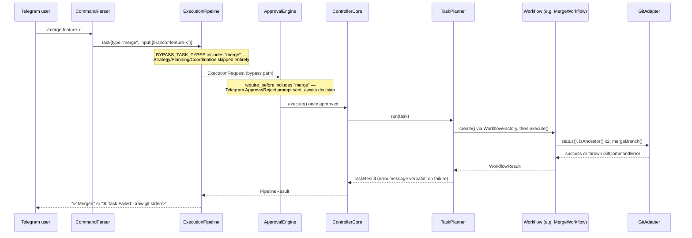
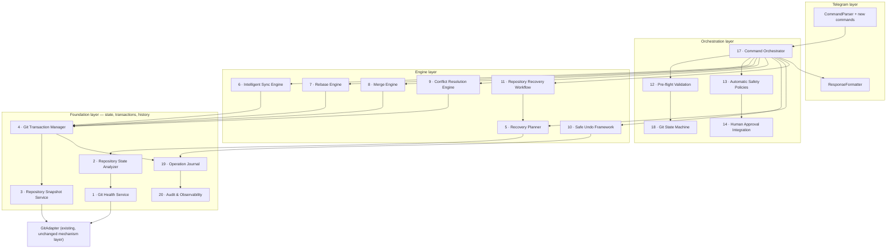
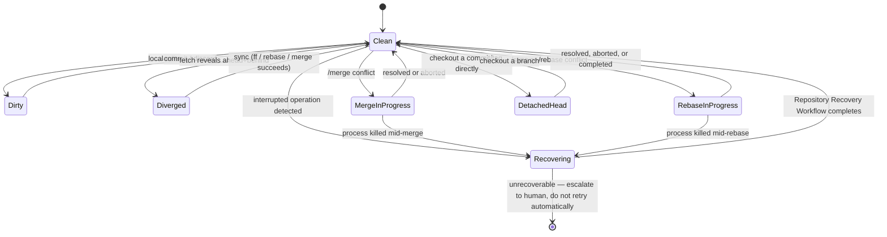
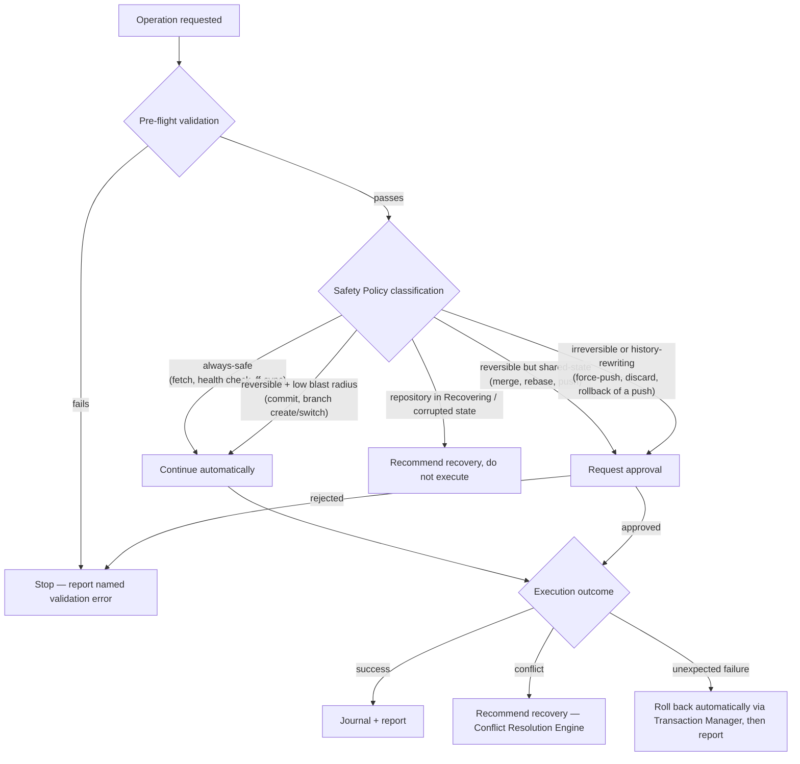

# Redesigning the Git Orchestration Subsystem for Autonomous, Terminal-Free Operation

**Design review — no implementation**

A staff-engineer-level review of the current seven-command git surface, the ten failures surfaced through real Telegram usage, and a target architecture — twenty components, a repository health model, a recovery engine, and a phased migration — for a controller that must eventually manage repositories safely without a human at a terminal.

**Scope:** /fetch /sync /merge /commit /push /undo /branch
**Repo:** ai-controller
**Status:** Architecture & roadmap only — nothing in this document has been implemented

---

## Table of contents

- [Executive summary](#executive-summary)
- [1 · Current architecture](#1--current-architecture)
- [2 · Root cause analysis](#2--root-cause-analysis)
- [3 · Target architecture — twenty components](#3--target-architecture--twenty-components)
- [4 · Command design](#4--command-design)
- [5 · Repository health model](#5--repository-health-model)
- [6 · Recovery engine](#6--recovery-engine)
- [7 · Command surface changes](#7--command-surface-changes)
- [8 · Autonomous decision framework](#8--autonomous-decision-framework)
- [9 · Future edge cases](#9--future-edge-cases)
- [10 · Implementation roadmap](#10--implementation-roadmap)

---

## Executive summary

The seven git commands work today because each one solves a narrow, well-defined problem in isolation. They fail as a system because there is no shared model of *what state the repository is actually in*, no shared mechanism for *undoing a git-native mutation*, and no path for *recovering* when something goes wrong. Every workflow re-derives its own safety checks from scratch, git errors that aren't explicitly anticipated pass through unmodified, and the one review-gate the system does have — `AwaitHumanReview` — is architecturally unreachable from any of the seven commands in scope.

The ten problems reported are not ten unrelated bugs. They are symptoms of four missing pieces:

- A **single source of truth for repository state** (today: six raw fields; needed: a full health model covering in-progress operations, lock files, worktrees, and more).
- A **transaction envelope around every mutating git operation** (today: only Claude's own file edits are snapshotted; a commit, merge, or branch switch has no recorded "before" to roll back to).
- A **policy layer that decides divergence handling, conflict handling, and recovery** instead of each workflow independently refusing and pointing the user elsewhere.
- A **journal and state machine** that make "what happened, and what state am I in now" answerable without reading raw git output.

The target architecture in §3–§8 adds these four pieces as new components that sit *underneath* the existing command surface, reusing the mechanism-vs-policy separation, decorator-based composition, and pure-policy-object conventions already established elsewhere in this codebase (`ApprovalEngine`, `UndoableTaskPolicy`, `ExecutionCheckpoint`) rather than introducing a parallel architectural style.

---

## 1 · Current architecture

All seven commands share one execution shape. `CommandParser` builds a `Task`, `ExecutionPipeline` recognizes it as **bypass-eligible** and skips Strategy/Planning/Coordination entirely, `ApprovalEngine` gates on config, `ControllerCore` hands it to `TaskPlanner`, `WorkflowFactory` builds the one workflow class for that task type, and the workflow talks to a fresh `GitAdapter` directly.

*Fig. 1 — Execution path for any of the seven git commands. The shape is identical for all seven; only the workflow and its approval requirement differ.*

### 1.1 Per-command architecture

| Command | Git operation(s) | Preconditions checked | Approval | On conflict / failure |
|---|---|---|---|---|
| `/fetch` | `git fetch` | None | None | Raw `GitCommandError` passthrough |
| `/sync` | `git fetch`; `git merge --ff-only @{upstream}` | Not detached HEAD · working tree clean | None | Refuses on divergence (`DivergedBranchError`, tells user to `/merge` — which structurally cannot do this, see §2) |
| `/merge <branch>` | `git merge --ff-only` or `--no-ff`; `git merge --abort` on failure | Not detached HEAD · target ≠ current branch · working tree clean | **Required** | Any failure → unconditional abort + `MergeConflictError`. No conflict inspection, no partial state, no resume. |
| `/commit <msg>` | `git add -A`; `git commit -m` | None ("nothing to commit" surfaces as raw git stderr) | None | Raw `GitCommandError` passthrough |
| `/push` | `git push --set-upstream origin HEAD` | **None** — no ahead/behind check, no dirty check | **Required** | Non-fast-forward rejection surfaces as raw git stderr, no retry/fetch-first logic |
| `/branch <name>` | `git checkout <name>` | Working tree clean | None | `UnsafeBranchSwitchError` with file counts |
| `/branch create <name>` | `git checkout -b <name>` | None (deliberately — new branch carries uncommitted changes forward safely) | None | Raw `GitCommandError` passthrough |
| `/undo` | `git restore --source`; direct unlink for new files | Not currently running · a checkpoint exists · no drift since | None | Reports specific status: nothing-to-undo, execution-in-progress, drift-detected |

### 1.2 The bypass path and where approval actually lives

All seven task types are listed in `ExecutionPipeline.BYPASS_TASK_TYPES`, which skips `StrategyEngine` / `PlanningEngine` / `ExecutionCoordinator` — those three exist to turn an ambiguous goal into a capability program, and a git command is already unambiguous. What bypass does *not* skip is `ApprovalEngine`, because `ControllerCore` as constructed at startup is already the approval-decorated instance; bypass and the full stack converge on the exact same gated entry point. Of the seven, only `push-changes` and `merge` appear in `config/controller.yaml`'s `approval.require_before` list, so only `/push` and `/merge` ever pause for a Telegram Approve/Reject prompt.

### 1.3 Coupling and duplication

> **Finding**
> Every precondition — "is the tree clean," "is HEAD detached" — is hand-written inside the workflow that happens to need it, not read from one shared repository-state object. `SyncWorkflow` and `MergeWorkflow` each independently call `status()` and inspect `isClean`; `SwitchBranchWorkflow` does the same with its own error type. `GitAdapter` is deliberately a pure mechanism layer with zero safety judgment (documented in its own source), which is the right instinct — but with no policy layer above it, that judgment is instead copy-pasted per workflow rather than centralized once.

### 1.4 `/undo`'s actual scope

`/undo` is not ambiguous in its implementation — it is precisely defined and quite narrow. `UndoableTaskPolicy` marks exactly two task types undoable: `implement-feature` and `fix-bug`. `TaskPlanner` only captures a before/after tree snapshot (via `GitAdapter.createSnapshot()`, a throwaway-index `write-tree`, never the real index or history) for those two. `UndoService.buildUndoPlan` restores working-tree file content from that snapshot — it never runs `git reset`, never runs `git revert`, never touches HEAD, a branch, or the remote.

> **Root cause of problem 4**
> `/undo` has **zero relationship** to `/commit`, `/push`, `/merge`, `/sync`, `/fetch`, or `/branch`. Running any of those and then `/undo` either reports "nothing to undo" or — more dangerously — silently reverts an unrelated, older Claude edit, because `UndoService` has no idea a non-undoable command ran in between. The ambiguity users experience is a real gap between what the word "undo" implies and what the one existing mechanism actually covers, not a bug in that mechanism itself.

### 1.5 The review gate that can't reach git commands

`AwaitHumanReview` → `HumanReview` capability → the pipeline's `"blocked"` outcome is the system's one existing "stop and ask a human" mechanism. It is produced exclusively by `StrategyEngine`, which only runs on the *non-bypass* path. Because all seven git commands are bypass-eligible by design, **none of them can ever trigger, or be blocked by, human review** — even if a repository-health concept existed today (it largely doesn't; see §5), the bypass path has no wiring to consult it. This is problem 6's structural cause: the recovery guidance a user gets after landing in a bad state is a static sentence from a completely different subsystem, with no crisp next action and no connection back to the git commands that would actually fix it.

---

## 2 · Root cause analysis

Mapping each reported problem to what's actually missing, rather than proposing a fix per symptom — several share one root cause.

| # | Problem | Root cause | Addressed by |
|---|---|---|---|
| 1 | Same-branch divergence unresolved | `SyncWorkflow` explicitly refuses (`DivergedBranchError`) and defers to `/merge` — which cannot help (#3). | Intelligent Sync Engine, Rebase Engine |
| 2 | No `git pull --rebase` equivalent | No rebase task type, workflow, or git command exists anywhere in the codebase. | Rebase Engine |
| 3 | `/merge` can't sync current branch with its own upstream | `MergeTask.input.branch` models "merge this named branch." `@{upstream}` isn't a nameable branch in that model, and `SameBranchMergeError` actively rejects the degenerate case that would otherwise express it. | Intelligent Sync Engine (owns upstream reconciliation; Merge Engine stays "merge a named branch") |
| 4 | `/undo` ambiguous | Not actually ambiguous — narrowly scoped to two Claude-editing task types via tree-content snapshots, with no relationship to git-native mutations. See §1.4. | Git Transaction Manager + Operation Journal + Safe Undo Framework (ref-based, not tree-content-based, for git-native ops) |
| 5 | No safe way to discard working tree changes | No `discard` task type exists; the only path is manual `git checkout --`/`git clean` outside the controller entirely. | New `/discard` command, gated by Pre-flight Validation + mandatory snapshot |
| 6 | No guided recovery from Human Review Required | `AwaitHumanReview` only reachable from the non-bypass path; git commands can neither trigger nor consult it (§1.5). | Recovery Planner + Repository Recovery Workflow, wired into *both* bypass and full-stack paths |
| 7 | `/push` doesn't verify upstream sync | `PushChangesWorkflow` is a single unconditional `git push` call — no `status()`, no ahead/behind check. | Pre-flight Validation Layer |
| 8 | Incomplete repository health validation | `GitStatus` exposes six fields; no in-progress-operation, lock-file, worktree, submodule, or LFS detection anywhere. | Git Health Service + Repository State Analyzer (§5) |
| 9 | No repository recovery engine | Confirmed absent — no recovery-oriented task type, command, or workflow exists. | Recovery Planner (§6) |
| 10 | Fragmented workflow, manual decisions | No orchestration layer sits above individual workflows; each command is an island with its own hand-rolled preconditions. | Command Orchestrator + Git State Machine + Automatic Safety Policies (§8) |

---

## 3 · Target architecture — twenty components

Every component below is scoped to slot into the existing layering (mechanism in `src/git`, policy as pure zero-I/O objects, orchestration in `src/planner`/`src/pipeline`, transport-facing formatting in `src/telegram`) rather than introducing a second architectural style next to the first.

*Fig. 2 — Layered target architecture. Foundation components never make policy decisions (matching `GitAdapter`'s existing "mechanism, never judgment" contract); everything above them does.*

### 3.1–3.20 Component definitions

#### 1 · Git Health Service

Owns exactly one read: produce a `RepositoryHealthReport` (full schema in §5) from the live repository. Replaces ad hoc `status()` calls scattered per workflow with one canonical read every other component consumes. Pure read, no caching across calls — health can change between two commands seconds apart, and staleness here is far more dangerous than a redundant git invocation.

#### 2 · Repository State Analyzer

Consumes a `RepositoryHealthReport` and classifies it into one `RepositoryState` value from the Git State Machine (§3.18) — `Clean`, `Dirty`, `MergeInProgress`, `Diverged`, `DetachedHead`, `Recovering`, etc. Where Health Service answers "what do I observe," the Analyzer answers "what does that mean" — the same read/interpret split `RuntimeStatusService`/`RuntimeDiagnosticsEngine` already use elsewhere in this codebase.

#### 3 · Repository Snapshot Service

Generalizes `GitAdapter.createSnapshot()`/`diffChangedFiles()`/`restorePaths()` — already used exclusively by the undo mechanism today — into a shared primitive any component can call. Snapshots are cheap (a throwaway-index `write-tree`, no working-tree copy), so **every** mutating operation gets one, not just the two Claude-editing task types.

#### 4 · Git Transaction Manager

The mechanism that finally makes commit/push/merge/sync/branch operations reversible. Wraps an operation as: snapshot before → attempt → on success, write a completed entry to the Operation Journal with before/after refs; on failure, restore from the pre-transaction ref and write a rolled-back entry. This is a **ref-based** transaction (git commits, branch pointers, reflog entries) — deliberately a sibling to the existing tree-content-based undo mechanism, not a replacement for it, because they solve different problems: one reverts Claude's file edits, the other reverts git's own state changes.

#### 5 · Recovery Planner

Given a `RepositoryHealthReport` in any non-`Clean` state, produces an ordered, human-readable `RecoveryPlan`: a sequence of specific, safe next actions (never raw git commands) with each step's own risk classification. Pure planning — it never executes anything itself, matching the existing "planning vs. execution" split between `PlanningEngine` and `ExecutionCoordinator`.

#### 6 · Intelligent Sync Engine

Supersedes `SyncWorkflow`. On divergence, instead of refusing, it consults `Automatic Safety Policies` for the configured divergence strategy (rebase, merge, or ask) and hands off to the Rebase or Merge Engine accordingly — this is the direct fix for problems 1 and 3. Still fast-forwards trivially when possible; the added intelligence only activates on genuine divergence.

#### 7 · Rebase Engine

New. Symmetric to the Merge Engine: pre-flight validate → snapshot via the Transaction Manager → `git rebase @{upstream}` → on conflict, hand off to the Conflict Resolution Engine with rebase-specific context (which commit, how many remain) → on success, journal the rewritten history explicitly, since rebased commits get new SHAs and any journal entry referencing the old ones must be updated, not silently orphaned.

#### 8 · Merge Engine

Formalizes today's `MergeWorkflow` logic (fast-forward check → real merge → abort-and-report on conflict) as its own component, now sharing the Conflict Resolution Engine with the Rebase Engine instead of hand-rolling its own abort-only handling.

#### 9 · Conflict Resolution Engine

New. Parses `git status`'s unmerged paths into a structured list of conflicted files with markers extracted. Offers three modes: **auto** (only for trivially non-overlapping or whitespace-only conflicts — everything else is never silently auto-resolved), **guided** (present the conflict to the operator over Telegram with ours/theirs/manual-resolve-then-continue choices, gated through Human Approval Integration), and **abort** (today's only behavior, kept as the universal fallback).

#### 10 · Safe Undo Framework

The ref-based sibling to today's tree-content `UndoService`. Reads the Operation Journal (not `ExecutionCheckpoint`) to reverse a specific git-mutating operation — `git reset --hard <pre-op-ref>` for a bad commit, deleting a local branch for an errant `create-branch`, force-push-with-lease back to a journaled pre-push ref for a push (always approval-gated — see §4). `/undo`'s Telegram surface stays one command; internally it now checks the journal for the most recent reversible operation of *either* kind (Claude edit or git-native) and reports precisely which it would revert before acting.

#### 11 · Repository Recovery Workflow

The guided, multi-step version of the Recovery Planner's output — turns a `RecoveryPlan` into an interactive Telegram sequence ("Step 1 of 3: abort the in-progress rebase — proceed?") rather than a wall of text. Directly closes problem 6.

#### 12 · Pre-flight Validation Layer

One pure policy object per operation type, replacing the copy-pasted `isClean`/detached-HEAD checks in `SyncWorkflow`/`MergeWorkflow`/`SwitchBranchWorkflow` today. Same shape as the existing `ApprovalPolicy`/`UndoableTaskPolicy`/`TaskCancellationPolicy`: zero I/O, takes a `RepositoryHealthReport` already fetched by the Health Service, returns a typed verdict. Adding a new precondition becomes a one-line policy change instead of a new hand-written check inside a workflow.

#### 13 · Automatic Safety Policies

The rules engine behind §8's decision framework — classifies every operation, given current health, into *always-auto*, *needs-approval*, or *must-stop*. Configuration-driven (extends `controller.yaml`'s existing `approval.require_before` pattern rather than inventing a new config surface).

#### 14 · Human Approval Integration

Not a new mechanism — an extension of the existing `TelegramApprovalProvider`/`ApprovalEngine` decorator pair to also gate Conflict Resolution Engine's guided mode and Recovery Planner's riskier steps, and critically, to give the *bypass path* a way to reach a review gate at all (closing the structural gap in §1.5) without pulling git commands back into the full Strategy/Planning stack they correctly don't belong in.

#### 15 · Rollback Strategy

Not a component so much as a contract every Engine must satisfy: given a Transaction Manager entry, produce the exact inverse operation. Fast-forward → reset to prior ref. Real merge → reset to prior ref (pre-merge commit is always still reachable). Rebase → reset to the pre-rebase ref recorded before rewriting. Commit → soft-reset one commit, preserving the diff as unstaged. Push → revert commit + force-push-with-lease, always approval-gated, never automatic.

#### 16 · Failure Recovery Strategy

The runtime counterpart to Rollback Strategy: what the Command Orchestrator does when an operation fails *mid-flight* rather than being deliberately undone later — network failure mid-push, process killed mid-rebase. Detected via the Operation Journal's own `in-progress` entries with no matching `completed`/`rolled-back` entry on the next health check, surfaced through the Recovery Planner as an "interrupted operation" state.

#### 17 · Command Orchestrator

The new choreography layer every mutating git command routes through: Pre-flight Validation → Health check → Safety Policy classification → (approval if required) → Transaction begin → Engine execution → Conflict check → Transaction commit or rollback → Journal write. Realized as a decorator, matching how `ApprovalEngine` already decorates `ControllerCore` — workflows keep owning git mechanics, the Orchestrator wraps them uniformly instead of each duplicating its own precondition dance.

#### 18 · Git State Machine

Formalizes the states the Repository State Analyzer classifies into, and which transitions are legal — e.g. `Clean → MergeInProgress` is legal via `/merge`; `MergeInProgress → Clean` is legal via successful completion or `/abort`; `MergeInProgress → Dirty` directly is not a state this system should ever produce silently. State diagram in §5.3.

#### 19 · Operation Journal

Append-only, superset of today's `ExecutionCheckpoint`: every mutating git operation (not just the two undoable task types), with before-ref, after-ref, status (`in-progress`/`completed`/`rolled-back`/`failed`), timestamp, and correlationId. Backbone for Safe Undo, Recovery Planner, and Audit — one durable record instead of three separate ad hoc ones.

#### 20 · Audit & Observability Layer

Not a new logging subsystem — the Operation Journal's entries feed the existing `ProjectMemoryService` event log (already wrapped around `ControllerCore` via the `MemoryRecordingControllerCore` decorator) with git-specific structured fields, so `/history` already shows richer git detail with no new user-facing surface.

---

## 4 · Command design

Full specification for the seven existing commands as redesigned, plus the new commands introduced in §7. Every command routes through the Command Orchestrator (§3, component 17); fields below describe what happens *inside* that routing for each specific command.

### `/fetch`

*No approval · Read-only · No rollback needed*

- **Purpose:** Update remote-tracking refs only; never touches the working tree, index, or current branch.
- **Execution flow:** Health check (cheap, informational only) → `git fetch` → re-read health → report new ahead/behind and any newly-diverged state.
- **State transitions:** None to the working tree; remote-tracking refs move. Never changes `RepositoryState`.
- **Validation:** None required — the one git operation with no meaningful precondition.
- **Rollback / retry:** Not applicable / safe to retry unconditionally (idempotent).
- **Failure scenarios:** Network failure, auth failure, remote deleted.
- **Recovery:** Report and let the user retry — no state was mutated, so there is nothing to recover *from*.

### `/sync`

*No approval (FF) / configurable (rebase) · Delegates on divergence*

- **Purpose:** Bring the current branch up to date with its upstream by whatever safe means apply — fast-forward when possible, otherwise hand off per policy.
- **Execution flow:** Pre-flight (clean, attached) → fetch → classify: up-to-date / fast-forwardable / diverged → fast-forward directly, or consult Automatic Safety Policies' divergence strategy and delegate to Rebase Engine or Merge Engine.
- **State transitions:** `Clean → Clean` (fast-forward) or hands off into the delegated engine's own transitions.
- **Validation:** Not detached HEAD · working tree clean (via Pre-flight Validation Layer, not a hand-rolled check).
- **Rollback:** Fast-forward path: reset to pre-sync ref. Delegated path: whatever the chosen engine's own strategy is.
- **Retry:** Safe after a network failure; unsafe to blindly retry after a delegated rebase/merge failure without re-checking health first.
- **Failure scenarios:** Network failure · divergence with policy set to "ask" (falls through to approval) · delegated conflict.
- **Recovery:** Recovery Planner step: "rebase in progress, N commits remain" or "merge conflict on 2 files" with the guided workflow attached.

### `/merge <branch>`

*Approval required · Conflict-aware*

- **Purpose:** Merge one explicitly named branch into the current one. No longer responsible for upstream reconciliation — that's the Sync Engine's job.
- **Execution flow:** Pre-flight → snapshot (Transaction Manager) → fast-forward if possible, else real merge → on conflict, hand to Conflict Resolution Engine instead of unconditional abort.
- **State transitions:** `Clean → Clean` (success) or `Clean → MergeInProgress` (conflict, held for guided resolution instead of always auto-aborting).
- **Validation:** Not detached HEAD · target ≠ current · working tree clean.
- **Rollback:** Reset to pre-merge ref (journaled). Always available even after a completed merge, not just a conflicted one.
- **Retry:** Not safe to blindly retry a conflicted merge; retry means resuming resolution, not re-running the command.
- **Failure scenarios:** Conflict · target branch doesn't exist · unrelated histories.
- **Recovery:** Guided conflict resolution (auto / guided / abort) via the Conflict Resolution Engine, or explicit `/abort`.

### `/commit <message>`

*No approval · Trivially reversible*

- **Purpose:** Stage everything and commit with the given message.
- **Execution flow:** Pre-flight (message non-empty; something staged-or-stageable exists — replaces today's raw "nothing to commit" git error with a named validation failure) → snapshot → `add -A` + commit → journal.
- **State transitions:** `Dirty → Clean` (typical case).
- **Validation:** Non-empty message · at least one change to commit.
- **Rollback:** Soft-reset one commit, changes return to staged — cheap, safe, always available.
- **Retry:** Safe — re-running after a genuine failure (e.g. hook rejection) is idempotent.
- **Failure scenarios:** Empty working tree · pre-commit hook rejection.
- **Recovery:** Named validation error up front; hook rejection surfaces the hook's own message directly rather than a generic git failure.

### `/push`

*Approval required · Force-push always separately gated*

- **Purpose:** Publish local commits to the configured remote.
- **Execution flow:** Pre-flight: fetch first, then verify local is a fast-forward of remote (direct fix for problem 7) → if diverged, refuse and recommend `/sync` first, never silently force → push.
- **State transitions:** No working-tree state change; moves the remote branch pointer.
- **Validation:** Local is fast-forward of remote upstream (post-fetch) · branch protection rules honored, not bypassed.
- **Rollback:** Revert commit + force-push-with-lease. **Always** requires explicit approval regardless of global config — a rewritten remote history is the single highest-blast-radius operation in this whole subsystem.
- **Retry:** Safe to retry after a network failure only; never retry blindly after a rejection without re-syncing.
- **Failure scenarios:** Non-fast-forward rejection · branch protection rejection · network failure.
- **Recovery:** Recommend `/sync` (with divergence handling already built in) rather than a raw retry.

### `/branch <name>` · `/branch create <name>`

*No approval*

- **Purpose:** Switch to, or create and switch to, a branch.
- **Execution flow:** Switch: pre-flight clean check → checkout. Create: no dirty check needed (carries changes forward safely, as today) → checkout -b.
- **State transitions:** Branch pointer only; working tree state unchanged (create) or must already be clean (switch).
- **Validation:** Switch: working tree clean · target branch exists. Create: name doesn't already exist.
- **Rollback:** Switch back to the prior branch (journaled). Create: delete the new branch if nothing has been committed to it yet.
- **Retry:** Safe.
- **Failure scenarios:** Dirty tree (switch) · name collision (create) · target doesn't exist (switch).
- **Recovery:** Named error with file counts (already the case today) — kept as-is, it already works well.

### `/undo`

*Two mechanisms, one command · Ref-based undo of git ops approval-gated if pushed*

- **Purpose:** Reverse the most recent reversible action — Claude's file edits *or* a git-native operation, whichever is more recent.
- **Execution flow:** Check Operation Journal (git-native) and `ExecutionCheckpoint` history (Claude edits) for the most recent entry of either kind → report exactly which one and what it will do *before* acting → execute the matching Rollback Strategy.
- **State transitions:** Depends entirely on what's being undone — this command's whole redesign goal is making that explicit instead of implicit.
- **Validation:** Nothing currently running · no drift since the operation (working-tree case) · not already pushed (git-native case, unless explicitly approved).
- **Rollback of the rollback:** Not supported in v1 — undo is not itself undoable in the first release; flagged as a future edge case (§9).
- **Failure scenarios:** Nothing to undo · drift detected · target was already pushed to a shared remote.
- **Recovery:** Already-pushed case explicitly requires approval and produces a revert commit rather than history rewrite when the branch is shared.

---

## 5 · Repository health model

Today's `GitStatus` is six fields (`branch`, `ahead`, `behind`, `staged`, `unstaged`, `untracked`, `isClean`). The model below is the superset the Git Health Service (§3, component 1) produces — every dimension the review asked for, each mapped to how it's actually detected.

### 5.1 Detection dimensions

| Dimension | Detection | Today |
|---|---|---|
| Ahead / behind | `git status --porcelain=v2 --branch` `branch.ab` | Present |
| Divergence (ahead > 0 *and* behind > 0) | Derived boolean from the above — currently nowhere derived, only two separate `isAncestor()` calls per workflow | Partial |
| Detached HEAD | `git symbolic-ref -q HEAD` exit code, not string-matching `branch === "HEAD"` | Implicit only |
| Merge in progress | Presence of `.git/MERGE_HEAD` | Absent |
| Rebase in progress | Presence of `.git/rebase-merge` or `.git/rebase-apply` | Absent |
| Cherry-pick in progress | Presence of `.git/CHERRY_PICK_HEAD` | Absent |
| Revert in progress | Presence of `.git/REVERT_HEAD` | Absent |
| Bisect in progress | Presence of `.git/BISECT_LOG` | Absent |
| Stash state | `git stash list` count | Absent |
| Untracked / staged / unstaged | `git status --porcelain=v2` line classification | Present |
| Dirty working tree | Derived from the three above | Present (as `isClean`) |
| Branch protection | GitHub API (already has an adapter — `src/github`) — protection rules for the current branch | Absent |
| Deleted upstream | `git rev-parse --abbrev-ref @{upstream}` failure after a fetch | Absent |
| Force-push detection | Compare local reflog's previous remote-tracking SHA against the newly-fetched one for a non-fast-forward, non-locally-caused move | Absent |
| Remote changes since last look | Diff of remote-tracking ref before/after fetch | Absent |
| Lock files | Presence of `.git/index.lock`, `.git/HEAD.lock` | Absent |
| Interrupted operations | Union of the in-progress markers above with no matching Operation Journal completion | Absent |
| Multiple worktrees | `git worktree list --porcelain` | Absent |
| Submodules | Presence of `.gitmodules` + `git submodule status` | Absent |
| Shallow clone | Presence of `.git/shallow` | Absent |
| LFS repository | Presence of `.gitattributes` filter=lfs entries + `git lfs status` if the CLI is present | Absent |
| Binary conflicts | Conflict Resolution Engine flags a conflicted path as binary via `git check-attr`/content sniffing rather than attempting a textual diff | Absent |

### 5.2 Design principle: additive, not replacing

`GitStatus` stays exactly as-is for the many existing consumers that only need the six current fields (`RepositoryIntelligenceService`, `DecisionEngine`, `StrategyEngine`, `RecommendationEngine`). `RepositoryHealthReport` is a new, separate, richer type the Git Health Service produces *in addition to* — not instead of — today's `status()`, so nothing existing has to change shape to get the new detail.

### 5.3 Git State Machine

*Fig. 3 — Legal repository states and transitions. Any state reachable only via "process killed" is `Recovering`, never silently reported as `Clean`.*

---

## 6 · Recovery engine

Each scenario below is a `RepositoryState` the Repository State Analyzer can classify into (or a transition failure detected by the Command Orchestrator). The Recovery Planner turns each into an ordered plan; only the steps marked auto run without a Telegram approval prompt.

| Scenario | Detected via | Recovery plan | Auto? |
|---|---|---|---|
| Failed pull (fetch ok, merge/rebase fails) | Operation Journal: fetch completed, following step failed | Report exact conflict/error; offer guided resolution or abort | No |
| Failed push | Non-zero exit from `git push` | Re-fetch, report new divergence, recommend `/sync` | Report only |
| Failed merge (conflict) | `.git/MERGE_HEAD` present | Conflict Resolution Engine: list conflicted files, offer auto/guided/abort | No |
| Failed rebase (conflict) | `.git/rebase-merge` present | Same as merge, plus "commit N of M" progress context | No |
| Interrupted operation (process killed) | In-progress marker with no matching Journal completion | Repository Recovery Workflow: identify exact operation, offer resume or abort | No |
| Generic conflict | Unmerged paths in `git status` | Conflict Resolution Engine | No |
| Dirty working tree blocking an operation | Pre-flight Validation failure | Offer `/discard` (destructive, approval-gated) or commit/stash first | No |
| Repository corruption | `git fsck` reports errors | Stop. Recommend re-clone into a fresh worktree; never attempt automatic repair of object-database corruption | Never |
| Detached HEAD | `branch === "HEAD"` / `symbolic-ref` failure | If reachable from a branch tip, offer to create a branch here; otherwise warn about orphaning on next checkout | Report + offer |
| Orphan commits (post-rebase, post-reset) | Reflog entries with no reachable branch/tag | Surface via `/undo`/journal for a bounded window (reflog's own ~90-day default) before they're eligible for GC | Report only |
| Aborted operation left artifacts | Lock files present with no active process | Verify no git process actually holds the lock, then offer removal — never remove blindly | Approval |

---

## 7 · Command surface changes

| Candidate | Verdict | Reasoning |
|---|---|---|
| `/pull` | Fold into /sync | "Pull" is fetch+integrate — `/sync` already owns exactly that. A separate `/pull` would just be a second name for the same operation and split the divergence-handling logic across two commands. |
| `/rebase` | New command | Needs to exist standalone (not just inside `/sync`) for the case of rebasing onto something that isn't the current upstream — e.g. rebasing a feature branch onto `main` before opening a PR. |
| `/discard` | New command | Directly closes problem 5. Always snapshots first (Transaction Manager) so it's itself undoable — "safe" is the entire point of the request. |
| `/recover` | New command | The user-facing entry point to the Repository Recovery Workflow — triggered automatically when a command detects a bad state, but also directly invocable. |
| `/health` | New command | Read-only surface for the Repository Health Model (§5) — the single most requested missing visibility, and trivially safe since it has no side effects. |
| `/git doctor` | Fold into /health + /recover | "Doctor" as commonly understood is diagnose (→ `/health`) plus fix (→ `/recover`). A third command would just be an alias pointing at the other two combined — not worth a third name to remember over Telegram. |
| `/stash` | Fold into /discard's safety mechanism | The Transaction Manager's automatic snapshot-before-mutate already gives every command stash-equivalent safety without the user needing to think in stash terms. A literal `git stash` UX (named, listable, poppable) is real but genuinely lower priority than the snapshot mechanism it would sit on top of — candidate for a later phase, not core to this redesign. |
| `/unstash` | Same as /stash | Only relevant if `/stash` ships as a first-class, named concept. |
| `/resume` | New command | The explicit "continue the interrupted operation" counterpart to `/abort` — both are needed once Recovering is a real state (§5.3), not just detected but actionable. |
| `/abort` | New command | Currently only reachable implicitly (Merge Engine's own internal abort-on-conflict). Promote to a first-class, explicitly invocable command so a user mid-conflict isn't stuck waiting for the engine to decide for them. |

Net new commands: `/rebase`, `/discard`, `/recover`, `/health`, `/resume`, `/abort`. `/pull` and `/git doctor` are deliberately not added — folding them avoids two commands that would only ever be a thin alias for something else.

---

## 8 · Autonomous decision framework

Every operation, once classified by Automatic Safety Policies, lands in exactly one of five buckets. This is what makes the difference between "the controller asks about everything" (today, for the two gated commands) and "the controller only asks when it should."

*Fig. 4 — Decision framework. "Roll back automatically" only applies to operations the Transaction Manager itself wrapped — never a blind retry, and never for a push already accepted by the remote.*

### 8.1 Classification table

| Class | Examples | Behavior |
|---|---|---|
| Continue automatically | `/fetch`, `/health`, fast-forward `/sync`, `/commit`, `/branch` | No prompt. Reversible, low blast radius, or genuinely read-only. |
| Request approval | `/merge`, `/rebase` onto a non-upstream target, `/push`, guided conflict resolution | Telegram Approve/Reject, existing mechanism, unchanged. |
| Stop execution | Pre-flight validation failure, repository corruption, unrelated histories | Never silently proceeds; always a named error, never a raw git error passthrough. |
| Recommend recovery | Any `Recovering`/`MergeInProgress`/`RebaseInProgress` state encountered by an unrelated command | The requested operation is refused with a pointer to `/recover`, rather than attempted on top of an already-abnormal state. |
| Rollback automatically | An operation the Transaction Manager wrapped that fails partway through, before anything left the local repository (i.e. never after a push has been accepted remotely) | Restores the pre-transaction ref, reports what happened and that it was reverted — the one case where the controller acts without asking, because the alternative is leaving the repository in a worse state than before the command ran. |

The line that must never move: **anything that could rewrite shared/remote history is always approval-gated, with no configuration path to make it automatic.** Everything else follows the classification above, driven by config the same way `approval.require_before` already is today.

---

## 9 · Future edge cases

Beyond the ten reported problems — what else becomes likely once the controller operates repositories unattended, over long stretches, without a terminal as a fallback.

### 9.1 Concurrency & identity

- Two Telegram commands racing against the same repository — `task.max_concurrent_jobs` already limits this globally, but per-repository locking doesn't yet exist explicitly for git-mutating operations specifically.
- A human operating the repository directly over SSH at the same time as the controller — the controller has no way to detect "someone else is also here right now" beyond noticing unexpected state on its next health check.
- Commit authorship/identity when the controller commits — whose name and email land in the commit, and whether that's distinguishable from a human's own commits in blame/log.

### 9.2 History & scale

- Very large diffs/monorepo-scale changes making a full pre-operation snapshot (§3, component 3) itself slow or memory-heavy.
- Extremely long-lived branches where `ahead`/`behind` counts become large enough that a rebase touches hundreds of commits — the Rebase Engine's conflict-per-commit handling needs a sane batching/progress story, not a hang.
- Reflog expiry silently making an "orphan commit" recovery step unreachable after ~90 days — the Recovery Planner needs to know its own recovery window has a deadline, not report a plan that quietly can't work.

### 9.3 Repository shape

- Shallow clones — several operations in this design (snapshot diffing, rebase, orphan-commit recovery) assume full history is available; a shallow clone needs its own degraded-but-safe behavior, not a confusing failure.
- Submodules — a "clean" superproject with a dirty/detached submodule is a real, easy-to-miss state; today's health model (and the proposed one, absent explicit submodule recursion) can silently miss it.
- Multiple worktrees sharing one `.git` — a lock held by another worktree looks identical to an orphaned lock from the controller's own crashed process unless worktree-awareness is explicit.
- LFS objects failing to download/upload independently of the git operation itself succeeding — a "successful" push that left LFS pointers unresolved is a silent partial failure.

### 9.4 Remote & policy

- Branch protection rules changing mid-operation (approved at pre-flight, rejected at push time) — the window between validation and execution is never zero.
- A force-push from someone else landing between the controller's fetch and its own subsequent operation — detected as "remote changes since last look" (§5.1), but the recovery story for "the branch I was about to build on just moved" needs to be explicit, not a generic conflict.
- Repository transferred, renamed, or made private mid-session — auth/URL assumptions baked into `config/repositories.yaml` going stale without a clear failure mode.
- Signed commits/GPG requirements — a policy the controller must honor, not bypass, and must fail clearly on rather than silently produce an unsigned commit a protected branch then rejects.

### 9.5 Controller-specific

- The controller process itself crashing mid-transaction — this is exactly why the Operation Journal's `in-progress` status (§3, component 19) exists, but it needs to be durable (written before the git command runs, not after) or the crash window is unrecoverable by definition.
- Config changes (repository path, approval policy) applied while an operation is genuinely in flight.
- A Recovery Plan itself becoming stale because the repository changed again before the operator acted on it — plans should be re-validated at execution time, not trusted as still-accurate from when they were generated.

---

## 10 · Implementation roadmap

Ordered so each phase is independently shippable and the foundation lands before anything depends on it — the inverse of the dependency graph in Fig. 2, foundation first.

### Phase 1 — Foundation

**Components 1–4, 19** · Git Health Service · Repository State Analyzer · Repository Snapshot Service · Git Transaction Manager · Operation Journal

- **Why first:** every other component reads a `RepositoryHealthReport` or writes to the Journal — nothing above this layer can be built, let alone tested, without it existing first.
- **Priority:** Health Service and State Analyzer are additive (new read path, §5.2) — zero risk to existing commands. Transaction Manager and Journal are also additive until Phase 2 wires them into existing workflows.
- **Dependencies:** none beyond the existing `GitAdapter`, which needs a small number of new read-only primitives (worktree list, stash list, in-progress-marker file checks) — mechanical additions to an already-established pure-mechanism class, not a redesign of it.
- **Risk:** low. Nothing user-facing changes; this phase is purely internal plumbing.
- **Migration:** none required — existing `GitStatus` consumers are untouched.

### Phase 2 — Retrofit existing commands

**Components 12, 17, 18** · Pre-flight Validation Layer · Command Orchestrator · Git State Machine — applied to the existing seven commands

- **Why second:** closes problems 7, 8, 10 without adding a single new command — replaces each workflow's hand-rolled precondition checks with the shared Pre-flight layer, and wraps all seven in the Orchestrator's snapshot-then-journal envelope.
- **Priority:** highest-value, lowest-new-surface-area phase — this is where `/push` gets its missing upstream check and every mutating command becomes reversible via the Journal, before any new command exists to leverage it.
- **Dependencies:** Phase 1 complete.
- **Risk:** medium — this phase changes behavior of commands already in production use (e.g. `/push` now refuses on divergence instead of always attempting). Needs explicit rollout communication, not just a silent behavior change.
- **Migration:** existing workflow classes are refactored to delegate their precondition checks to the new policy objects rather than rewritten from scratch — `MergeWorkflow`'s conflict-abort logic, for instance, stays as the fallback path even after the Conflict Resolution Engine exists (Phase 3).

### Phase 3 — New engines & commands

**Components 6–11, 13–14** · Intelligent Sync Engine · Rebase Engine · Conflict Resolution Engine · Safe Undo Framework · Recovery Planner · Repository Recovery Workflow · Automatic Safety Policies · Human Approval Integration extension — plus `/rebase /discard /recover /health /resume /abort`

- **Why third:** directly resolves problems 1, 2, 3, 4, 5, 6, 9 — but every one of these depends on Phase 1's Journal/Transaction Manager and Phase 2's Orchestrator already routing traffic uniformly.
- **Priority:** Rebase Engine and Intelligent Sync Engine first (problems 1–3, the most concretely reported pain), Conflict Resolution Engine and Safe Undo Framework second (higher complexity, more failure surface to get right), Recovery Planner and its command surface last (depends on the others existing to have anything to plan around).
- **Dependencies:** Phases 1–2 complete.
- **Risk:** highest in the roadmap — conflict resolution and rebase are the two operations with the most ways to go subtly wrong. Ship auto-resolve conservatively (trivial cases only, expand later) and keep `/abort` as an always-available, always-tested escape hatch before anything else in this phase ships.
- **Migration:** genuinely new commands — no existing behavior to migrate, but `/help`/`TELEGRAM_COMMANDS.md` need the same documentation treatment every prior command addition in this codebase has received.

### Phase 4 — Audit, hardening, autonomy

**Component 20** · Audit & Observability · edge cases from §9 · expanded Automatic Safety Policies for autonomous (non-Telegram) triggering

- **Why last:** this is where "autonomous, terminal-free" actually gets exercised — every prior phase was still fundamentally reactive to a Telegram command. Phase 4 is what lets `AutonomousExecutionWorker` (already the one existing non-Telegram execution trigger) safely reach into git-mutating operations using the exact same safety machinery, rather than a separate, parallel set of rules.
- **Priority:** submodule/LFS/shallow-clone/worktree edge cases (§9.3) before concurrency/identity edge cases (§9.1) — the former can silently corrupt state today with zero warning, the latter are lower-probability given `max_concurrent_jobs` already limits the worst case.
- **Dependencies:** Phases 1–3 complete and observed in real usage — this phase should be informed by what actually broke in Phase 3, not planned purely in advance.
- **Risk:** the "autonomous triggering" piece specifically needs its own explicit go/no-go review before enabling — everything up to this point still has a human approving the risky operations; this phase is where that assumption is deliberately relaxed, and it should be relaxed slowly, one operation class at a time, not all at once.
- **Migration:** `controller.yaml`'s approval config gains per-operation-class autonomy toggles, defaulting to today's fully-manual behavior — nothing becomes more autonomous without an explicit opt-in.

---

*Architecture review only — no code in this repository was modified to produce this document. Ground-truth facts about the current implementation were verified directly against the source in `src/git`, `src/planner`, `src/pipeline`, `src/approval`, and `src/undo` before this review was written.*
